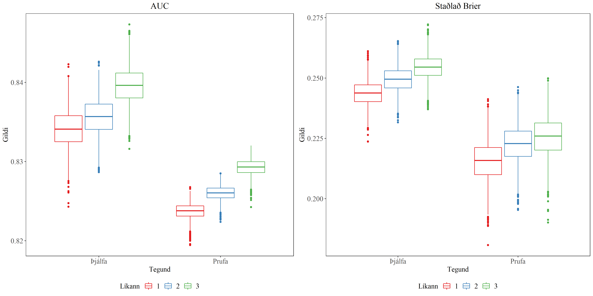

```{r setup, include=FALSE}
knitr::opts_chunk$set(echo = TRUE)
options(knitr.kable.NA = '')

source('Script/Settings.R')

hashAnswer <- read.csv('Data/hashAnswer4.csv')
hashAnswer <- hashAnswer %>% subset(select=-c(X))
hashAnswer$hsta <- hashAnswer$hsta%>%as.character()
hashAnswer$lectureId <- hashAnswer$lectureId %>% as.factor()
hashAnswer$studentId <- hashAnswer$studentId %>% as.factor()
hashAnswer$nicc <- hashAnswer$nicc %>% as.factor()
hashAnswer$hluta2 <- cut_interval(hashAnswer$hluta, n = 5)
```

```{r shorter table, echo = F}
hashLim50 <- hashAnswer %>% group_by(studentId) %>% mutate("count" = n()) %>%
  filter(count > 7 & fsfat < 50)
hashLim100 <- hashAnswer %>% group_by(studentId) %>% mutate("count" = n()) %>%
  filter(count > 7 & fsfat < 100)
```


```{r model creation, echo=F, cache=TRUE}
fit1 <- glmer(correct ~ fsfat*hsta + nicc + gpow + lectureId + (1 | studentId), 
              family = binomial(link = "logit"), data = hashLim100, nAGQ = 0, control =
                glmerControl(optimizer="bobyqa", optCtrl=list(maxfun=2e5)))
fit3 <- glmer(correct ~ hluta2+hsta + nicc + gpow + lectureId + (1 | studentId), 
              family = binomial(link = "logit"), data = hashLim100, nAGQ = 0, control = 
                glmerControl(optimizer="bobyqa",optCtrl=list(maxfun=2e5)))
fit7 <- glmer(correct ~ hluta2 + fsfat + hsta + nicc + gpow + lectureId + (1 | studentId), 
              family = binomial(link = "logit"), data = hashLim100, nAGQ = 0, control = 
                glmerControl(optimizer="bobyqa",optCtrl=list(maxfun=2e5)))
```
\newpage

# Ágrip {-}
\textbf{Inngangur:} Sumar spurningar í tutor-web eru búnar til þannig að kennarinn semur fyrst haus spurningar, næst eru tvö söfn búinn til, það fyrsta inniheldur rétt svör og sá næsti inniheldur röng svör. Svo eru spurningarnar búnar til með því að velja slembið rétt svar og slurk af röngum svörum (kannski með allt/ekkert ofangreint er rétt). Ef nemandi lærir ekki bara utanað, heldur er að auka skilning á verkefnið, þá ættu að sjást smátt og smátt framfarir í einkunn líka fyrir nýjar fullyrðingar. Svo markmið rannsóknarinnar er að sjá hvort hægt er að skoða framfarir nemenda, en ekki bara utanbókarlærdóm. \textbf{Aðferð:} Í þessari rannsókn var byrjað á því að setja upp myndir tengt meðaltali réttra svara eftir fjölda spurninga svaraðra, til að sjá hvort það sæist framfarir eftir því sem fleiri spurningum er svarað. Eftir það voru stillt upp þrjú Tvíkosta aðhvarfsgreininglíkön með slembiþætti til að skoða hvort marktækni fjölda spurninga svaraðra er enn sterk með áhrif utanbókarlærdóms í sama líkani. Það var gert með því að hafa eitt líkan byggt í kringum fjölda spurninga svarað, annað byggt í kringum hlutfall rangra svarmöguleika sem hafa sést áður og í lokinn líkan sem er byggt á báðum breytunum. \textbf{Niðurstöður:} Frá meðaltals myndunum þá sást að það gæti verið hægt að skoða framfarir, en óvissa hvort framfarirnar sem sást voru aðallega áhrif utanbókarlærdómar. Þegar skoðað var líköninn, þá sást að fjöldi spurninga svarað fram að þessu var ennþá marktækt, með áhrifum utanbókarlærdóms innihaldinn í líkönunum, sem gæti verið að benda til þess að hægt sé að skoða þá framfarir í gegnum breytu tengt fjölda spurninga svarað.
\textbf{Umræða:} Það var set up bootstrap fyrir gögninn til að fá gott áhorf á AUC og staðlað Brier skorinu fyrir líkönin þrjú, þar sást ekki mikill munur milli líkananna. Það gæti verið að segja að  utanbókarlærdóms áhrif hlutfall rangra svara sem hafa sést áður er líkt styrkleikanum á að skoða fjölda spurninga svarað, sem sýnir stóru áhrif utanbókarlærdóms á líkur nemanda að svara næstu spurningu.

\newpage

\tableofcontents

\newpage
# Inngangur
Sumar spurningar í tutor-web eru búnar til þannig að kennarinn semur fyrst haus spurningar, næst eru tvö söfn búinn til, það fyrsta inniheldur rétt svör og sá næsti inniheldur röng svör. Svo eru spurningarnar búnar til með því að velja slembið rétt svar og slurk af röngum svörum (kannski með allt/ekkert ofangreint er rétt). Ef nemandi lærir ekki bara utanað, heldur er að auka skilning á verkefnið, þá ættu að sjást smátt og smátt framfarir í einkunn líka fyrir ný svör. 

Markmið rannsóknarinnar var að athuga hvort hægt væri að sjá framfarir nemenda, en ekki bara utanbókarlærdóm. Með því að skoða hvernig líkurnar á að svara spurningu breytist eftir því sem fleiri spurningum er svarað og skoðað fyrir sitthvor tilvik eftir því hvað af svarmöguleikunum hafa sést áður.

# Aðferð

## Þáttakendur
Úrtak rannsóknarinnar voru nemendur í líkindareikningur og tölfræði á vormisserinu 2020. Þar voru `r hashAnswer$studentId %>% unique() %>% length()` nemendur sem svöruðu samtals 108.017 spurningum í heild.
`r #getur verið að það eru 294 nemendur, hmmm`

## Tölfræðileg úrvinnsla

### Hugbúnaður
Öll tölfræðileg úrvinnsla, meðhöndlun gagna og líkanasmíð fór fram á forritunarmálinu R, með R Development Core Team (2009). _R: A Language and Environment for Statistical Computing_. R
Foundation for Statistical Computing, Vienna, Austria. ISBN 3-900051-07-0, <URL:
http://www.R-project.org>.

Með eftirfarandi pakka:

Wickham H, Ruiz E (2020). _dbplyr: A 'dplyr' Back End for Databases_. R package version 1.4.3, <URL:
https://CRAN.R-project.org/package=dbplyr>.

Wickham H, François R, Henry L, Müller K (2020). _dplyr: A Grammar of Data Manipulation_. R package
version 0.8.5, <URL: https://CRAN.R-project.org/package=dplyr>.

Ooms J, James D, DebRoy S, Wickham H, Horner J (2020). _RMySQL: Database Interface and 'MySQL'
Driver for R_. R package version 0.10.20, <URL: https://CRAN.R-project.org/package=RMySQL>.

Wickham H, Henry L (2020). _tidyr: Tidy Messy Data_. R package version 1.0.3, <URL:
https://CRAN.R-project.org/package=tidyr>.

Venables WN, Ripley BD (2002). _Modern Applied Statistics with S_, Fourth edition. Springer, New
York. ISBN 0-387-95457-0, <URL: http://www.stats.ox.ac.uk/pub/MASS4>.

Wickham H (2016). _ggplot2: Elegant Graphics for Data Analysis_. Springer-Verlag New York. ISBN
978-3-319-24277-4, <URL: https://ggplot2.tidyverse.org>.

Auguie B (2017). _gridExtra: Miscellaneous Functions for "Grid" Graphics_. R package version 2.3,
<URL: https://CRAN.R-project.org/package=gridExtra>.

Wickham H, Averick M, Bryan J, Chang W, McGowan LD, François R, Grolemund G, Hayes A, Henry L,
Hester J, Kuhn M, Pedersen TL, Miller E, Bache SM, Müller K, Ooms J, Robinson D, Seidel DP, Spinu V,
Takahashi K, Vaughan D, Wilke C, Woo K, Yutani H (2019). “Welcome to the tidyverse.” _Journal of
Open Source Software_, *4*(43), 1686. doi: 10.21105/joss.01686 (URL:
https://doi.org/10.21105/joss.01686).

Wickham H (2020). _modelr: Modelling Functions that Work with the Pipe_. R package version 0.1.7,
<URL: https://CRAN.R-project.org/package=modelr>.

Henry L, Wickham H (2020). _rlang: Functions for Base Types and Core R and 'Tidyverse' Features_. R
package version 0.4.6, <URL: https://CRAN.R-project.org/package=rlang>.

Bergsma T (2018). _latexpdf: Convert Tables to PDF or PNG_. R package version 0.1.6, <URL:
https://CRAN.R-project.org/package=latexpdf>.

Meschiari S (2015). _latex2exp: Use LaTeX Expressions in Plots_. R package version 0.4.0, <URL:
https://CRAN.R-project.org/package=latex2exp>.

Xie Y (2020). _knitr: A General-Purpose Package for Dynamic Report Generation in R_. R package
version 1.28, <URL: https://yihui.org/knitr/>.

Xie Y (2015). _Dynamic Documents with R and knitr_, 2nd edition. Chapman and Hall/CRC, Boca Raton,
Florida. ISBN 978-1498716963, <URL: https://yihui.org/knitr/>.

Xie Y (2014). “knitr: A Comprehensive Tool for Reproducible Research in R.” In Stodden V, Leisch F,
Peng RD (eds.), _Implementing Reproducible Computational Research_. Chapman and Hall/CRC. ISBN
978-1466561595, <URL: http://www.crcpress.com/product/isbn/9781466561595>.

LeDell E, Petersen M, van der Laan M (2014). _cvAUC: Cross-Validated Area Under the ROC Curve
Confidence Intervals_. R package version 1.1.0, <URL: https://CRAN.R-project.org/package=cvAUC>.

Fox J, Weisberg S (2019). _An R Companion to Applied Regression_, Third edition. Sage, Thousand Oaks
CA. <URL: https://socialsciences.mcmaster.ca/jfox/Books/Companion/>.

Arnold JB (2019). _ggthemes: Extra Themes, Scales and Geoms for 'ggplot2'_. R package version 4.2.0,
<URL: https://CRAN.R-project.org/package=ggthemes>.

Kassambara A (2020). _ggpubr: 'ggplot2' Based Publication Ready Plots_. R package version 0.3.0,
<URL: https://CRAN.R-project.org/package=ggpubr>.

Zhu H (2019). _kableExtra: Construct Complex Table with 'kable' and Pipe Syntax_. R package version
1.1.0, <URL: https://CRAN.R-project.org/package=kableExtra>.

Xie Y (2020). _bookdown: Authoring Books and Technical Documents with R Markdown_. R package version
0.19, <URL: https://github.com/rstudio/bookdown>.

Xie Y (2016). _bookdown: Authoring Books and Technical Documents with R Markdown_. Chapman and
Hall/CRC, Boca Raton, Florida. ISBN 978-1138700109, <URL: https://github.com/rstudio/bookdown>.

Wickham H, Seidel D (2020). _scales: Scale Functions for Visualization_. R package version 1.1.1,
<URL: https://CRAN.R-project.org/package=scales>.

Xie Y (2020). _tinytex: Helper Functions to Install and Maintain 'TeX Live', and Compile 'LaTeX'
Documents_. R package version 0.24, <URL: https://github.com/yihui/tinytex>.

Xie Y (2019). “TinyTeX: A lightweight, cross-platform, and easy-to-maintain LaTeX distribution based
on TeX Live.” _TUGboat_, 30-32. <URL: http://tug.org/TUGboat/Contents/contents40-1.html>.

Bates D, Mächler M, Bolker B, Walker S (2015). “Fitting Linear Mixed-Effects Models Using lme4.”
_Journal of Statistical Software_, *67*(1), 1-48. doi: 10.18637/jss.v067.i01 (URL:
https://doi.org/10.18637/jss.v067.i01).

Kuznetsova A, Brockhoff PB, Christensen RHB (2017). “lmerTest Package: Tests in Linear Mixed Effects
Models.” _Journal of Statistical Software_, *82*(13), 1-26. doi: 10.18637/jss.v082.i13 (URL:
https://doi.org/10.18637/jss.v082.i13).

Saefken B, Ruegamer D, with contributions from Sonja Greven, Kneib T (2018). _cAIC4: Conditional
Akaike information criterion for lme4_.

Saefken B, Ruegamer D, Kneib T, Greven S (2018). “Conditional Model Selection in Mixed-Effects
Models with cAIC4.” _ArXiv e-prints_. 1803.05664.

Borchers HW (2019). _pracma: Practical Numerical Math Functions_. R package version 2.2.9, <URL:
https://CRAN.R-project.org/package=pracma>.

Casas P (2020). _funModeling: Exploratory Data Analysis and Data Preparation Tool-Box_. R package
version 1.9.4, <URL: https://CRAN.R-project.org/package=funModeling>.

Francois R (2020). _bibtex: Bibtex Parser_. R package version 0.4.2.2, <URL:
https://CRAN.R-project.org/package=bibtex>.

### Github Kóði
Aðgangur að kóðanum færst í gegnum Github á https://github.com/gylfii/Sumarverkefni-Gylfi (EKKI ENN ORÐIÐ PUBLIC)

### Gögn
Gögninn sem notast var við, voru annaðhvort tekin beint úr SQL gragnagrunni eða afhent sem .txt skrá. Frá SQL gagnagrunninum var fengið gagnasett fyrir öll svör nemanda, gagnasett fyrir allar spurningar og svo gagnasett fyrir stillingu nemenda innan við hvern fyrirlestur. Svo texta skrár með hash fyrir alla réttu svarmöguleikana og ranga svarmöguleikana. Tafla \@ref(tab:table1) inniheldur þeir breytur sem voru geymdar eftir sameiningu.

```{r table1, echo=F}

data.frame(Breyta = c("lectureId", "studentId", "questionId", "correct", "hash", "fsfat", "hsta", 
                      "hluta", "timeDif", "nicc", "gpow", "hluta2"), 
           Tegund = c("Merkibreyta", "Merkibreyta", "Merkibreyta", "Flokkabreyta", "Flokkabreyta", 
                      "Samfelld breyta", "Flokkabreyta", "Samfelld breyta", "Samfelld breyta", 
                      "Flokkabreyta", "Samfelld breyta", "Flokkabreyta"), 
           Skýring = c("Númer fyrirlesturs", "Númer nemenda", "Númer spurningar", 
                       "Hvort svarað var rétt eða rangt", "Hver svarmöguleikinn er", 
                       "Fjöldi spurninga svarað fram að þessari spurningu", 
                       "Hef séð þetta rétta svar áður", "hlutfall rangra svarmöguleika sem hafa sést áður", 
                       "Tímamunur séðan rétta svarið sást seinast", "Fjöldi vitlausa svarmöguleika", 
                       "Erfileika hraði fyrir uppkomandi spurningar", 
                       "Strjált hlutfall rangra svarmöguleika sem hafa sést áður")) %>% 
  kable(digits = 4, booktabs = T, 
     caption = "Breytur sem voru eftir í gögnunum", 
     linesep = '') %>% 
  kable_styling() %>%
  row_spec(row = 0, bold = T)
```


### Gagnavinnsla
Til að fá gagnasettið yfir í loka formið, þá var framkvæmt eftirfarandi aðgerðir.

Fyrsta skrefið var að tengja saman öll gagnasettin. Byrjandi með því að tengja svörinn og spurningarnar, svo hægt væri að tengja við réttu og röngu svörinn seinna. Eftir það var tengt við fyrirlestra stillingar nemenda til að finna *gpow* þeirra. Svo var tengt við röngu svörinn og reiknað var *hluta*, en þar var tapað u.þ.b. `r 108017-101994` línum. Svo í lokinn var tengt réttu svörinn og reiknað hvort nemandinn hafi séð svarið áður eða ekki fyrir hverja spurningu.

Ákveðið var að taka minna en allt gagnasafnið, með því að skoða ekki spurningar sem koma eftir að nemandinn hefur svarað 100 sinnum. Þetta kemur frá þeirri hugsun að eftir að hafa svarað svona margar spurningar, þá er nemandinn ekki að sjá mikið nýtt, svo ekki er hægt að sjá framfarir við sambærilegar spurningar þar.


### Breytur
Það voru nokkrar breytur sem var þurft að búa til, þær voru *fsfat*, *hsta*, *hluta* og *hluta2*. 

   * Fyrir *fsfat*, semsagt "Fjöldi spurninga fram að þessu", sem telur spurningarnar sem hafa verið svarað hingað til. Aðferðin til að búa til *fsfat* fór svona:
   
     1. Raða safninu eftir tíma sem spurninginn byrjaði
     2. fyrir hvern nemenda í hverjum fyrirlestri, telja upp frá 0 eftir röðinni.

\begin{itemize}
 \item[] Þar sem einhverjar línur detta út þegar bætt er við *hluta* og það eru 3 línur sem koma þegar AOTA+ spurningu er að ræða, þá er búið til fsfat áður sameinað við .txt skránnar með réttu og röngu svörinn.
\end{itemize}

   * Að næstu fyrir *hsta*, semsagt "hef séð þetta rétta svar áður". Fyrir hvern nemenda, þá var fundið fyrsta skiptið sem nemandinn sá rétta svarmöruleikann, svo var sett að ef nemandinn sá það í fyrsta skiptið, þá hafði hann ekki séð svarmöguleikann áður, annars hefur nemandinn séð svarmöguleikann áður. Nema í tilvikum þar sem NOTA+ spurning er að ræða, semsagt "None of the above" er rétta svarið. Þá var sett að ef hlutfall rangra svarmöguleika sem nemandinn hafi séð áður væri 100%, þá er talið að nemandinn hafi séð rétta svarið áður.
   
   * Næst var sett upp hluta, semsagt "hlutfall rangra svarmöguleika sem hafa sést áður". Þar var fyrst fundið fyrir hvern nemenda, hvort ranga svarið hafi sést áður og sett upp eins og hsta. Eftir það var tekið meðaltal rangra svara sem hafa sést áður til að fá hlutfallið. Sér hugsun þurfti að koma tengt spurningu með "all of the above" sem rangur möguleiki og "None of the above" sem rangur möguleiki. Fyrir fyrra tilvikið var skoðað hvort eitthvað af hinum röngu valmöguleikunum hafa sést áður, ef svo þá var hugsað eins og "all of the above" ranga svarið hafi sést áður. Fyrir "NOTA-" þá var skoðað hvort rétta svarið hafi sést áður, ef svo þá var hugsað eins og "NOTA-" svarmöguleikinn hafi sést áður.
   
   * Að lokum fyrir *hluta2* þá var skipt *hluta* upp í 5 jafn langa parta, semsagt tilvikin þegar 0%-20% af röngu svarmöguleikunum hafa sést áður, tilvikin fyrir 20%-40% og svo framvegis upp að 80%-100%.


### Aðferðarfræði við líkanasmið

Það voru gerð þrjú Tvíkosta aðhvarfsgreininglíkön með slembiþætti, þar sem aðalmunur þeirra er breyting á tvemur breytum. Líköninn eru:

   * Fyrsta líkanið: \begin{equation} \text{logit}(y) = \beta_0 + \text{fsfat} + \text{hsta}_k + \text{fsfat:hsta} + \text{nicc}_l + \text{gpow} + \text{lectureId}_m + \text{studentId}_n (\#eq:mod1) \end{equation}
   * Annað líkanið: \begin{equation} \text{logit}(y) = \beta_0 + \text{hluta2}_s + \text{hsta}_k + \text{nicc}_l + \text{gpow} + \text{lectureId}_m + \text{studentId}_n (\#eq:mod2) \end{equation}
   * Þriðja líkanið: \begin{equation} \text{logit}(y) = \beta_0 + \text{fsfat} + \text{hsta}_k + \text{hluta2}_s + \text{nicc}_l + \text{gpow} + \text{lectureId}_m + \text{studentId}_n (\#eq:mod3) \end{equation}

Með þessum líkönum, væri hægt að skoða hvort það koma framfarir. Þar sem hugsuninn byggist á því að ef *fsfat* er ennþá marktækt, þá eru framfarir að sjást. Því sem fleiri spurningar eru svarað, þá eru líkurnar á að næstu spurningu er svarað rétt að hækka, það er svo hægt að sjá sem framfarir. Á móti kemur áhrif utanbókarlærdóms, sem kemur frá réttu og röngu svarmöguleikunum sem hafa komið áður, semsagt *hsta* og *hluta*. Svo hægt er að sjá hvort *fsfat* er ennþá marktækt ef tekið er með áhrif utanbókarlærdóms.

# Niðurstöður

## Lýsandi tölfræði

### Öll gögn

Tafla \@ref(tab:Table1) inniheldur fjölda og hlutfall hverrar flokkabreytu fyrir öll gögninn.
```{r Table1, echo = FALSE}
createUsable <- function(df){
  t <- table(df$hsta)
  fr1 <- rbind(fjoldi = t, hlutfall = prop.table(t)) %>% t() 

  t2 <- table(df$lectureId)
  fr2 <- rbind(fjoldi = t2, hlutfall = prop.table(t2)) %>% t() 

  t3 <- table(df$correct)
  fr3 <- rbind(fjoldi = t3, hlutfall = prop.table(t3)) %>% t() 

  t4 <- table(df$hluta2)
  fr4 <- rbind(fjoldi = t4, hlutfall = prop.table(t4)) %>% t() 

  fullthing <- rbind(fr3, fr1, fr4, fr2)
  fullthing[, 2] <- paste0(round(fullthing[, 2] * 100, digits = 1), "%")

  row.names(fullthing) <- c("Rangt", "Rétt", "Sést í fyrsta skipti", "Hef séð svarið áður", 
                          "0% - 20%", "20% - 40%", "40% - 60%", "60% - 80%", "80% - 100%", 
                          3082, 3201, 3202, 3203, 3204, 3208, 3209, 3210, 3211, 3212, 3213, 3214, 3215)
  return(fullthing)
}
fullthing <- createUsable(hashAnswer)

fullthing %>% kable(longtable = T, digits = 5, booktabs = T, 
                    caption = "Hlutföll flokkabreytanna", 
                    linesep = '',
                    col.names = c("Fjöldi", "Hlutfall")) %>%
   kable_styling() %>%
  pack_rows("correct", 1, 2) %>%
  pack_rows("hsta", 3, 4) %>%
  pack_rows("hluta2", 5, 9) %>%
  pack_rows("lectureId", 10, 22) %>%
  column_spec(1, width = "4cm") %>%
  row_spec(row = 0, bold = T)

```

Stórt hlutfall gagnanna sýnist vera spurningar sem voru svaraðar rétt, spurningar með rétta svarmöguleika sem nemendar hafa séð áður og spurningar þar sem nemandurnir hafa séð 80%-100% af röngu svarmöguleikunum áður. Semsagt ef skoðað eru öll gögninn, þá sést að nemendur eru ekki að sjá mikið af nýju efni, heldur mikið af endurtekningum.

Þar sem markmiðið er að skoða framfarir, þá er erfitt að sjá beinar framfarir yfir utanbókarlærdóm þegar nemendur hafa svarað mörgum spurningum, þar sem flestir svarmöguleikar hafa sést áður. Tafla \@ref(tab:limit-check) inniheldur hlutfall gagnanna sem eru eftir að hafa svarað ákveðið mikið af spurningum, til að fá innsæi hve mikið af gögnunum er eftir x spurningar svaraðar.

```{r limit-check, echo=F}
a <- hashAnswer %>% summarise("FY50" = sum(fsfat >= 50), "FY100" = sum(fsfat >= 100), 
                              "FY150" = sum(fsfat >= 150), "FY200" = sum(fsfat >= 200), 
                              "FY250" = sum(fsfat >= 250), "FY300" = sum(fsfat >= 300))
b <- hashAnswer %>% summarise("HY50" = mean(fsfat >= 50), "HY100" = mean(fsfat >= 100), 
                              "HY150" = mean(fsfat >= 150), "HY200" = mean(fsfat >= 200), 
                              "HY250" = mean(fsfat >= 250), "HY300" = mean(fsfat >= 300))
ab <- cbind(a, b)
FHbylim <- ab %>% pivot_longer(c('FY50', 'HY50', 'FY100', 'HY100', 'FY150', 'HY150', 'FY200', 'HY200', 'FY250', 'HY250', 'FY300', 'HY300'), 
                    names_to = "typewLim", values_to = "values") %>% 
  separate(typewLim, into = c("type", "limit"), sep = 2) %>% pivot_wider(names_from = type, values_from = values)

FHbylim$HY <- paste0(round(FHbylim$HY * 100, digits = 1), "%")
colnames(FHbylim) <- c("Mörk", "Fjöldi yfir", "Hlutfall yfir")
FHbylim %>% kable(digits = 4, booktabs = T, 
                  caption = "Hlutfall gagnanna eftir x spurningar svaraðar", 
                  linesep = '') %>% 
  kable_styling() %>%
  row_spec(row = 0, bold = T)
```

Það sést að `r FHbylim$HY[1]` af gögnunum eru svör eftir 50 spurningar svarað, en bara `r FHbylim$HY[2]` gagnanna eftir 100 spurningum. Svo til að geta fengið betri skoðun á gögnunum, þá var ákveðið að skipta gögnunum upp í tvö gagnasöfn, í fyrri er ekki leift meiri 100 fsfat og í seinni er ekki leift meira en 50 fsfat. Þau gagnasöfn eru notuð héðan í frá.


### Stytt gögninn


Tafla \@ref(tab:shorter-table-100) og \@ref(tab:shorter-table-50) eru alveg eins hlutfallstöflur og \@ref(tab:Table1), nema með styttri gögn. 


```{r shorter-table-100, echo=F}
fullt100 <- createUsable(hashLim100)

fullt100 %>% kable(longtable = T, digits = 5, booktabs = T, 
                   caption = "Hlutfall flokkabreytana fyrir fyrstu 100 svör", 
                   linesep = '',
                   col.names = c("Fjöldi", "Hlutfall")) %>%
   kable_styling() %>%
  pack_rows("correct", 1, 2) %>%
  pack_rows("hsta", 3, 4) %>%
  pack_rows("hluta2", 5, 9) %>%
  pack_rows("lectureId", 10, 22) %>%
  column_spec(1, width = "4cm") %>%
  row_spec(row = 0, bold = T)
```


```{r shorter-table-50,echo=F}
fullt50 <- createUsable(hashLim50)

fullt50 %>% kable(longtable = T, digits = 5, booktabs = T, 
                  caption = "Hlutfall flokkabreytana fyrir fyrstu 50 svör", 
                  linesep = '',
                  col.names = c("Fjöldi", "Hlutfall")) %>%
   kable_styling() %>%
  pack_rows("correct", 1, 2) %>%
  pack_rows("hsta", 3, 4) %>%
  pack_rows("hluta2", 5, 9) %>%
  pack_rows("lectureId", 10, 22) %>%
  column_spec(1, width = "4cm") %>%
  row_spec(row = 0, bold = T)
```

Frá töflu \@ref(tab:shorter-table-100) þá séstað hlutfall rangra svarmöguleika hækkar aðeins, sömuleiðis með rétt svör sem sést í fyrsta skiptið. En ekki endilega það mikið.

Fyrir töflu \@ref(tab:shorter-table-50) þá er hlutfall rangra svarmöguleika aftur aðeins stærra, svo er hvort rétta svarið hafi sést áður eða ekki er miklu nær helmingi en áður. Nemendur eru enn að sjá mikið af eindurtekningum, en það er orðið jafnara.

Til að geta séð hvernig árangur kemur með tíma, þá var skoðað meðaltal réttra svara fyrir hvert *fsfat* upp að 50 og svo upp að 100. Semsagt hvað er prósenta spurninga sem var svarað rétt hjá spurningu nr. x, þetta er svo skipt fyrir bæði réttu svör sem eru að sjást í fyrsta sinn og þau sem hafa sést áður. Mynd \@ref(fig:pltbymean50) sýnir tilvikið þegar skoðað er bara upp að 50 spurningum svarað, á meðan mynd \@ref(fig:pltbymean100) skoðar tilvikið þegar upp að 100 spurningum er svarað.


```{r pltbymean50, echo=FALSE, fig.align='center', fig.cap="Meðaltal réttra svara fyrir hvern fjölda spurninga svarað fram að þessu, semsagt hvað er prósenta spurninga sem var svarað rétt hjá spurningu nr. x, það er svo skipt upp eftir hvort rétta svarið hefur sést áður, fer svo upp að 50 svöruðum spurningum.", fig.pos='H', out.width='100%'}
include_graphics('Imgsimplify/plotbymean50.png')

```


```{r pltbymean100, echo=FALSE, fig.align='center', fig.cap="Meðaltal réttra svara fyrir hvern fjölda spurninga svarað fram að þessu, semsagt hvað er prósenta spurninga sem var svarað rétt hjá spurningu nr. x, það er svo skipt upp eftir hvort rétta svarið hefur sést áður, fer svo upp að 100 svöruðum spurningum.", fig.pos='H', out.width='100%'}
include_graphics('Imgsimplify/plotbymean100.png')
```

Frá mynd \@ref(fig:pltbymean50) þá sést greinilega að einhverjar framfarir eru að koma fram þegar rétti svarmöguleikinn er að koma í fyrsta skiptið, þar sem meðaltölinn eru að hækka því lengra sem er farið.
Fyrir mynd \@ref(fig:pltbymean100) þá sést að þegar það er farið lengra, þá fara tilvikin þar sem rétta svarið sést í fyrsta skiptið að jafnast út og byrjar að falla aðeins niður. Afhverju þetta jafnast svona út þegar lengra er farið gæti verið útaf því að dreifingin er óstöðugri þar sem lengra er farið, þar sem færri spurningar með réttu svörmöguleikana sem ekki hafa sést áður koma upp. Annað sem gæti verið hér að baki er að það sem sást á mynd \@ref(fig:pltbymean50) var ekki endilega beinar framfarir, en frekar það að nemandurnir eru að setja röngu svarmöguleikana á minnið. Þá er línan í myndinni að jafnast því að nemandirnir eru ekki að sjá mikið af nýjum mögulegum röngum svarmöguleikum lengur, svo línan jafnast út.

Hugmynd er að skoða líka sambærilega mynd, nema bara fyrir tilvikið þegar þetta eru ný svör og skipt upp eftir hlutfall rangra svarmöguleika sem hafa sést áður, þetta er gert til að sjá hvort innan við hvers hlutfallshóp það eru framfarir eða eru aðall framfarirnar stökkin frá einum hlutfallshópi yfir á næsta. Mynd \@ref(fig:meanbyhlutfall50) sýnir tilvikið þegar skoðað er upp að 50 spurningum svarað.

```{r meanbyhlutfall50, echo=FALSE, fig.align='center', fig.cap="Meðaltal réttra svara fyrir hvern fjölda spurninga svarað fram að þessu, semsagt hvað er prósenta spurninga sem var svarað rétt hjá spurningu nr. x, það er svo skipt upp eftir hlutfall rangra svarmöguleika sem hafa sést áður, fer svo upp að 50 svöruðum spurningum.", fig.pos='H', out.width='100%'}
include_graphics('Img/meanbyhlutfall.png')
```

Hér sést að þegar við skoðum eftir hlutföllum rangra svara, þá eru línunar orðnar jafnari en vöxturinn sem sást fyrst, það er smá vöxtur hjá 60%-80% og 80%-100%, eitthvað fall hjá 20%-40% og 40%-60% og svo rosalegt stökk hjá 0%-20%. óstöðugleikinn gæti verið að koma frá því að það eru mjög fáar breytur fyrir aftan sumt af punktunum, til að jafna það út þá var myndin endurgerð með þeim mun að fjarlægjt var punkta sem voru bara með 1 "observation" fyrir aftan þá. Mynd \@ref(fig:meanbyhlutfall50Lim) er því sama og mynd \@ref(fig:meanbyhlutfall50) nema með fjarlægða punkta með ekki meira en 1 "observation" fyrir aftan það.

```{r meanbyhlutfall50Lim, echo=FALSE, fig.align='center', fig.cap="Meðaltal réttra svara fyrir hvern fjölda spurninga svarað fram að þessu, semsagt hvað er prósenta spurninga sem var svarað rétt hjá spurningu nr. x, það er svo skipt upp eftir hlutfall rangra svarmöguleika sem hafa sést áður, fer svo upp að 50 svöruðum spurningum, með að minnsta kosti 2 svörum á hverjum punkti", fig.pos='H', out.width='100%'}
include_graphics('Img/meanbyhlutfallLim.png')
```

Stóra stökkið hjá 0%-20% tilvikinu er aðeins stöðugra, en fyrir utan það, þá er ekki nein breyting hér.

Til að fá betri sjónarhorn á hlutföllin, þá gæti verið gott að bæta við línurnar hjá hlutföllunum við mynd \@ref(fig:pltbymean50), semsagt hafa línuna fyrir tilvikið þegar nemandinn hefur ekki séð rétta svarið áður úr mynd \@ref(fig:pltbymean50) með línurnar hjá hlutfall röngu svarmöguleikana fram að þessu úr mynd \@ref(fig:meanbyhlutfall50Lim) hliðiná. Dökkbláa línan er upprunalega línan frá mynd \@ref(fig:pltbymean50), á meðan hinar línurnar eru fyrir sitthvora hlutfalls hópana.

```{r meanbyhlutfallandhsta, echo=FALSE, fig.align='center', fig.cap="Meðaltals mynd fyrir tilvikið þegar rétta svarið hefur ekki sést áður, fyrir bæði öll þau gögn og þegar skipt er eftir hlutfall rangra svarmöguleika. Fer upp að 50 spurningum svarað.", fig.pos='H', out.width='100%'}

```

Hér sést að á meðan upprunalega línan úr mynd \@ref(fig:pltbymean50) er vaxandi, þá eru hinar línurnar ekki að vaxa jafn mikið. Miklar sveiflur sjást hjá minni hlutföllunum, sem eru líklegast að koma frá því að ekki eru mikið af spurningum sem eru að koma upp með svona fáa ranga svarmöguleika. Það sést samt hjá 60%-80% að það er smá fall en svo byrja að koma framfarir í gang og hjá 80%-100% þá eru einhverjar framfarir í gangi en það jafnar sig svo aðeins út í lokinn.

Að sömu leiti getum við skoðað sömu mynd fyrir tilvikið þegar farið er upp að 100 spurningum svarað

```{r meanbyhlutfallandhsta100, echo=FALSE, fig.align='center', fig.cap="Meðaltals mynd fyrir tilvikið þegar rétta svarið hefur ekki sést áður, fyrir bæði öll þau gögn og þegar skipt er eftir hlutfall rangra svarmöguleika. Fer upp að 100 spurningum svarað.", fig.pos='H', out.width='100%'}

```

Það lítur út fyrir að vera einhverjar framfarir í gangi þar, hjá tilvikunum með 20%-60% þá er eitthvað að vaxa, spurning hvort þetta er að vaxa almennilega eða hvort þetta er að koma frá því tilviki að mjög fáar breytur eru að toga þeim upp. Fyrir tilvikin þegar 60%-80% af röngu svarmöguleikunum hafi sést áður þá er það að mesta lagi stöðugt með hægt fall niður og 80%-100% er mjög jafnt yfir allar línurnar.

### Smá samantekt fyrir myndirnar
Þegar við skoðuðum fyrstu myndina, þá leit út fyrir að einhverjir jákvæðir vextir voru að koma með fjölda spurninga svarað, þá kom spurningin hvort þessi vöxtur eru framfarir eða utanbókarlærdómur röngu svarana, þar sem fyrir því fleiri spurningum sem nemendarnir hafa svarað, því fleiri rangra svarmöguleika þeir hafa séð áður, það gæti bent til þess að vöxturinn er aðallega tengur utanbókdarlærdómi. Farið var því að skoða sambærilegt fyrir hlutföllin og þar sást að línurnar voru jafnari en upprunalega línan, en með einhverjum litlum framförum þar ennþá til staðar. 

Til að sjá hvort framfarirnar eru ennþá marktækar þá eru skoðuð þrjú tvíkosta aðhvarfsgreiningalíkönn með slembiþætti, þar sem nokkrar breytur eru alltaf til staðar hjá þeim öllum, en það er skipt upp þannig að fyrsta líkanið \@ref(eq:mod1) inniheldur fjölda spurninga svarað fram að þessu, næsta líkanið inniheldur hlutfall rangra svara fram að þessu flokkana og í lokinn er þriðja líkanið \@ref(eq:mod3) sem skoðar bæði fjölda spurninga fram að þessu og hlutfall rangra svara fram að þessu. Hugmyndinn er að ef fjöldi spurninga fram að þessu er enn marktæk eftir að bæta við hlutfall rangra svarmöguleika, þá gæti það verið að benda til þess að hægt sé að sjá framfarir nemenda.

## Líkanasmið

### Breytur

Það voru gerð þrjú líkönn til að skoða, þar sem aðal munurinn er hvort notað er *fsfat*, *hluta2* eða bæði. Hér sýnir tafla \@ref(tab:table-of-use) allar breyturnar sem eru í líkönunum, frá þeim sem eru í öllum líkönunum og þeim sem er skipt út á milli þeirra.

```{r table-of-use, echo = F, cache=TRUE}

data.frame(Breyta = c("lectureId", "hsta", "nicc", "gpow", "fsfat", "hluta2",  "studentId"),
           Tegund = c("Flokka", "Flokka", "Flokka", "Samfelld", "Samfelld", "Flokka", "Flokka"), 
           Flokkar = c("3082, 3201 - 3204, 3208 - 3215", "Sést í fyrsta skipti, Hef séð áður", 
                       "1, 2, 3, 4, 5, 6, 7", "", "", 
                       "[0-0.2], (0.2-0.4], (0.4-0.6], (0.6-0.8], (0.8-1]", "")) %>% 
  kable(longtable = T, digits = 5, booktabs = T, 
        caption = "Breytur notað í líkonunum", 
        linesep = '') %>%
  kable_styling() %>%
  pack_rows("Fixed effect fyrir öll líkön", 1, 4) %>%
  pack_rows("Slembiþáttur fyrir öll líkön", 7, 7) %>%
  pack_rows("Fixed effect breytist eftir líkani", 5, 6) %>%
  column_spec(1, width = "5cm") %>%
  row_spec(row = 0, bold = T)

```

Þar sem aðal munur líkananna þriggja er:

  * Fyrsta \@ref(eq:mod1): fsfat +  fsfat:hsta + ...
  * Annað \@ref(eq:mod2): hluta2 + ...
  * Þriðja \@ref(eq:mod3): fsfat + hluta2 + ...


### Val á líkani

\textbf{Fyrsta líkanið} \@ref(eq:mod1): Til að byrja með var skoðað hvernig væri að bæta við *fsfat* og víxláhrif á milli *fsfat* og *hsta*. Til að sjá hvernig framfarir eru í gangi. Þar sem hugsað er að jákvæð áhrif hjá *fsfat* gæti verið séð sem framfarir nemenda. 

Vandi kom upp frá hugsuninni hvort þetta voru framfarir, eða bara utanbókarlærdómur sem var fyrir aftan *fsfat* svo því var prufað að skipta út *hluta2* og *fsfat* til að sjá hvor hefur meiri áhrif.


\textbf{Annað líkanið} \@ref(eq:mod2): Hér var notað *hluta2* í stað *fsfat* og víxláhrif *hsta* og *fsfat*. Það var svo skoðað muninn á milli þeirra í gegnum anova til að sjá hvort væri sterkari, þar sést í töflu \@ref(tab:anova13) að samkvæmt anova þá er annað líkanið sterkari en fyrri líkanið.

```{r anova13, echo=F, warning=F}
an13 <- anova(fit1, fit3) %>% broom::tidy()
an13$term <- c("Fyrsta", "Annað")

an13 %>% kable(digits = 4, booktab = T, 
               caption = "anova milli fyrsta og annað líkanið", 
               linesep = '',
               col.names = c("Líkan", "npar", "AIC", "BIC", "logLik", "deviance", 
                             "statistic", "df", "p.value")) %>%
  kable_styling() %>%
  row_spec(row = 0, bold = T)

```

\textbf{Þriðja líkanið} \@ref(eq:mod3): Hér var notað *hluta2* og *fsfat* saman, til að sjá hvort enn er hægt að sjá framfarir með *fsfat* þegar *hluta2* er innifallið enn í líkaninu. Að sömu leiti var gert anova milli þriðja og annars líkansins. Þá sést skv. töflu \@ref(tab:anova37) að þriðja líkanið er sterkari en annað líkanið.

```{r anova37, echo=F, warning=F}
an37 <- anova(fit3, fit7) %>% broom::tidy()
an37$term <- c("Annað", "Þriðja")

an37 %>% kable(digits = 4, booktab = T, 
               caption = "anova milli annað og þriðja líkanið", 
               linesep = '', 
               col.names = c("Líkan", "npar", "AIC", "BIC", "logLik", "deviance", 
                             "statistic", "df", "p.value")) %>%
  kable_styling() %>%
  row_spec(row = 0, bold = T)

```

### Matsgæði líkana


```{r booteddata prep, echo=F}
load("Data/Bootedfit1")
load("Data/Bootedfit3")
load("Data/Bootedfit7")

optim.cal <- function(bdf) {
  # The original model on the original dataset
  B.app <- bdf[[1]]
  # The booted model on the booted dataset
  B.boot <- bdf[[2]]
  # The booted model on the original dataset
  B.or <- bdf[[3]]
  
  auc.app <- B.app$AUC
  Brier.app <- B.app$brier
  stBrier.app <- B.app$StanBrier
  
  auc.phi <- mean(B.boot$AUC - B.or$AUC)
  Brier.phi <- mean(B.boot$brier - B.or$brier)
  stBrier.phi <- mean(B.boot$StanBrier - B.or$StanBrier)
  
  optimism <- data.frame(AUC = auc.phi, brier = Brier.phi, stBrier = stBrier.phi)
  optimismcorrected <- data.frame(AUC = auc.app - auc.phi, brier = Brier.app - Brier.phi, stBrier = stBrier.app - stBrier.phi)
  
  return(list(optimism, optimismcorrected))
}

fit1.cal <- optim.cal(bootedfit1)
fit3.cal <- optim.cal(bootedfit3)
fit7.cal <- optim.cal(bootedfit7)

fit1.opt.cor <- fit1.cal[[2]]
fit1.opt.op <- fit1.cal[[1]]
fit3.opt.cor <- fit3.cal[[2]]
fit3.opt.op <- fit3.cal[[1]]
fit7.opt.cor <- fit7.cal[[2]]
fit7.opt.op <- fit7.cal[[1]]

```

Tafla \@ref(tab:Anova) er anova töflur af gerð III fyrir líköninn þrjú og það lítur út fyrir að allar breyturnar eru marktækar, hvort nemandinn hafi séð rétta svarið áður eða ekki sýnist svo vera sterkasta breytann í hvert skipti. Svo sýnist það vera að þegar sett er saman *fsfat* og *hluta2* í sama líkan, þá fellur styrkleikinn þeirra ágætlega mikið. (EKKI ALVEG VISS HVAÐ ÞAÐ ÞÝÐIR ENN)
```{r Anova, echo=F}
T1 <- Anova(fit1, type = 3) %>% broom::tidy() %>% mutate(model = 1)

T2 <- Anova(fit3, type = 3) %>% broom::tidy() %>% mutate(model = 2)

T3 <- Anova(fit7, type = 3) %>% broom::tidy() %>% mutate(model = 3)

aTable <- rbind(T1, T2, T3) %>%
  dplyr::select(5, everything())

aTable %>% kable(booktabs = T, 'latex',
        caption = 'Anova af gerð III fyrir líköninn þrjú',
        linesep = '',
        col.names = c('líkan', 'Breyta', 'Lýsitala', 'df', '$p$'),
        escape = F,
        align = rep('c', 5)) %>%
  kable_styling(full_width = F, latex_options = 'hold_position') %>%
  row_spec(row = 0, bold = T) %>%
  collapse_rows(1)


```

Fyrir matsgæði líkans var ákveðið að skoða AUC og staðlað Brier, þar sem AUC segir til um hve vel líkanið segir til að rétt svar er rétt á móti röngu svari, á meðan staðlað Brier er stiki sem segir til styrkleika spáinar, það var svo notað bootstrap með 2500 ítrunum til að skoða viðkvæmi líkananna við gagnavali og leiðrétta gildin fyrir bjartsýni. 

Tafla \@ref(tab:optimism-table-2) sýnir hér frammistöðu líkanana þriggja eftir AUC og staðlað Brier skorinu, eftir að leiðrétta fyrir bjartsýni með 2500 bootstrap ítranir. Það sést hér að munurinn á milli líkanana er ekki það mikill, þar sem stærsti munurinn er hjá fyrsta \@ref(eq:mod1) og þriðja líkaninu \@ref(eq:mod3) og það er ekki meira en `r round(fit7.opt.cor$AUC - fit1.opt.cor$AUC, digits = 4)` hjá AUC og `r round(fit7.opt.cor$stBrier - fit1.opt.cor$stBrier, digits = 4)` hjá staðlað Brier skorinu. Þá lítur út fyrir að það er ekki mikill munur þar með tilliti til AUC og staðlað Brier. Til að bæta þá inniheldur tafla \@ref(tab:optimism-table) bjartsýni líkananna þriggja, þar sést að bjartsýnin er rosalega líkt hjá þeim öllum þremur. 

Á mynd \@ref(fig:optimismpicture) sést svo hvernig AUC og staðlað Brier skorið dreifðist fyrir hverja ítrun. Þar sést að hvert líkan er aðeins hærra en það fyrra og að fyrir AUC þá er dreifingin á þjálfunar gildunum miklu meiri en hjá prufunar gildunum, en það er svo öfugt fyrir staðlað Brier, því þar er dreifingin hjá þjálfunar meiri en hjá prufunar gildunum.

```{r optimism-table-2, echo = FALSE}
rbind('1' = fit1.opt.cor, '3' = fit3.opt.cor, '7' = fit7.opt.cor) %>% dplyr::select(-c(brier)) %>% 
  kable(digits = 4, booktabs = T, 
        caption = "AUC og staðlað Brier skorið hjá líkonunum þremur leiðrétt fyrir bjartsýni", 
        linesep = '',
        col.names = c("AUC", "Staðlað Brier")) %>%
  kable_styling() %>%
  row_spec(row = 0, bold = T)
```

```{r optimism-table, echo = FALSE}
rbind('1' = fit1.opt.op, '3' = fit3.opt.op, '7' = fit7.opt.op) %>% dplyr::select(-c(brier)) %>% 
  kable(digits = 4, booktabs = T, 
        caption = "Bjartsýnin fyrir AUC og staðlað Brier skorið hjá líkönunum þremur", 
        linesep = '', 
        col.names = c("AUC", "Staðlað Brier")) %>%
  kable_styling() %>%
  row_spec(row = 0, bold = T)
```


```{r optimismpicture, echo=FALSE, fig.align='center', fig.cap="Dreifing AUC og staðlað Brier fyrir hvert líkan, hjá þjálfunar og prufunar bootstrap gildunum", fig.pos='H', out.width='100%'}

```

Mynd \@ref(fig:Calibration-histogram) inniheldur kvörðunar graf og stuðlarit yfir fjölda gagnanna fyrir spáðu útkomurnar. Þar sést að halinn er smá skakkur og af, en það passar þar sem ekki er mikið af gögnum hjá þeim punktum. Það kemur smá frávik nær miðjunni, en annars lítur þetta vel út. 

```{r Calibration-histogram, echo=F, fig.align='center', fig.cap="Að ofan er Kvörðunar graf og að neðan er stuðlarit yfir fjölda gagnanna fyrir spáður útkomurnar. Fyrir öll líkönin þrjú", fig.pos='H', out.width='100%'}

```


# Umræða
Markmið verkefnisins er að sjá hvort hægt sé að mæla framfarir, en ekki bara utanbókarlærdóm. Til að gera það var byrjað að sjá hvort hægt væri að finna jákvæðar breytingar þegar svarað eru fleiri og fleiri spurningar með því að skoða myndir með meðaltali spurninga sem var svarað rétt eftir því hve margar spurningar nemandarnir hafði svarað hingað til og skipt upp eftir því hvort nemandarnir höfðu séð rétta svarmöguleikann áður eða ekki. Þar sást einhverjar framfarir í gangi, en óvissa var hvort þetta voru beinar framfarir eða utanbókarlærdómur á röngu svarmöguleikunum. Þá var skoðað líka mynd með tilliti til hlutfall rangra svarmöguleika sem hafa sést áður. Þar leit út fyrir að vera eitthverjar framfarir, sumar jákvæðar og sumar neikvæðar. En annars miklu beinari línur en fyrri. Til að gá hvort þetta voru framfarir í gangi þar, þá voru skoðuð nokkur líkunn, með þá hugmynd að baki að ef fjöldi spurninga fram að þessu er enn marktæk með öllum utanbókarlærdómi með í líkaninu, þá gæti það verið að benda til þess að hægt er að mæla framfarir nemendans. Þessi þrjú líkönn voru lík að mörgu leiti nema það var smá breyting milli tveggja breyta. Fyrsta líkanið \@ref(eq:mod1) innhélt fjöldi spurninga fram að þessu, til að sjá framfarir nemenda, annað líkanið \@ref(eq:mod2) innihélt hlutfall rangra svarmöguleika sem hafa sést áður og að lokum þriðja líkanið \@ref(eq:mod3) sem innihélt bæði fjölda spurninga fram að þessu og hlutfall rangra svarmöguleika sem hafa sést áður. 


## Fyrsta líkanið \@ref(eq:mod1)
Til að byrja með, þá var gert fyrsta líkanið \@ref(eq:mod1) til að sjá hvort það væri hægt að sjá framfarir eftir því hve margar spurningar nemandinn hafði svarað hingað til innan í fyrirlestrinum. Þar var breyta yfir því hvort rétta svarið hafi sést áður og víxláhrif á milli þess og fjölda spurninga svarað. Þar sást að fjöldi spurninga svarað var marktæk og framfarir sást þar. 

Vandi kemur upp að þegar svarað hefur mikið, þá er stærri og stærri hlutfall af röngu svarmöguleikunum sem hafa sést áður, því getur vel verið að framfarirnar sem eru að sjást hér, eru í raun bara utanbókarlærdómur rangra svara sem er að toga upp líkurnar á því að svara rétt. Því var skoðað hlutfall rangra svarmöguleika án fjölda spurninga fram að þessu.

## Annað líkanið \@ref(eq:mod2)
Þegar skoðað var annað líkanið \@ref(eq:mod2), þá var séð að hluta2 er marktæk breyta miðað við Anova III. Til að sjá muninn milli fyrra líkansins og þessara þá var gert anova á milli þeim til að sjá hvort af líkönunum voru marktækari, skv. anova þá er annað líkanið sterkara en fyrra líkanið. Svo var skoðað aðeins staðlað Brier score og AUC þeirra tveggja, þar leit út fyrir að annað líkanið er aðeins sterkara en það fyrra, með muninn milli þeirra sem `r round(fit3.opt.cor$AUC - fit1.opt.cor$AUC, digits = 4)` hjá AUC og `r round(fit3.opt.cor$stBrier - fit1.opt.cor$stBrier, digits = 4)` hjá staðlað Brier skorinu. Svo á meðan annað líkara er sterkara miðað við anova, þá er munurinn ekki endilega það mikill. Þetta bendir til þess að fjöldi spurninga svarað fram að þessu er jafn sterkt og að skoða hlutföllin þeirra, eru þá framfarirnar sem sáust áður bara útaf hlutfall röngru svara, eða voru framfarir þar?

Til að skoða það, þá er skoðað þriðja líkanið \@ref(eq:mod3), þá er innihaldið bæði fjöldi spurninga fram að þessu og hlutfall rangra svarmöguleika fram að þessu, en víxláhrifin á milli fjölda spurninga fram að þessu og hvort rétta svarið hafi sést áður er horfið.

## Þriðja líkanið \@ref(eq:mod3)
Að lokum var sett saman þriðja líkanið \@ref(eq:mod3), í líkaninu er bæði fjöldi spurninga fram að þessu og hlutfall rangra svarmöguleika sem hafa sést áður. Þar var bæði fjöldi spurninga og hlutfall rangra svarmöguleika marktækt, svo var þriðja líkanið sterkara en annað \@ref(eq:mod2) og fyrsta \@ref(eq:mod1) líkönin, ef skoðað er til staðlað Brier og AUC leiðrétt eftir bjartsýni þá lítur út fyrir að munurinn milli þriðja og annars er líka mjög lítill, þar sem munurinn milli þriðja og Annars líkansins er `r round(fit7.opt.cor$AUC - fit3.opt.cor$AUC, digits = 4)` hjá AUC og `r round(fit7.opt.cor$stBrier - fit3.opt.cor$stBrier, digits = 4)` hjá staðlað Brier skorinu. Þetta bendir til að öll þrjú líköninn eru lík í styrkleika miðað við staðlað Brier og AUC á meðan þriðja líkanið er sterkast af þeim miðað við anova.

Hvað þýðir þetta? Frá þessu sjáum við að fjöldi spurninga fram að þessu er ennþá marktækt, þótt það sé bætt við utanbókaráhrifum hjá því hvort rétti svarmöguleikinn hafi sést áður og hlutfall rangra svarmöguleika sem hafa sést áður, þar bendir til þess að hægt sé að mæla áhrif nemenda. Þar sem stikinn fyrir fsfat er séð sem framfarir. 

## Smá loka niðurstöður og horfur
Svo frá líkönunum er hægt að finna rök fyrir bæði að nógu sterkt er að skoða bara hlutfall rangra svarmöguleika sem hafa sést áður og að skoða fjölda spurninga svarað miðað við að AUC og staðlað Brier skorið er mjög líkt milli líkanana þriggja, þetta gæti verið að benda til rosalegu sterku áhrif utanbókarlærdóms til að sjá hvernig svarað er næst. 

Á sömu mótum þá er fyrsta \@ref(eq:mod1) og þriðja \@ref(eq:mod3) líkönin líka í sama styrkleika miðað við AUC og staðlað Brier skorið, semsagt hægt er að fá stika fyrir fjölda spurninga fram að þessu. Sem leyfir því að mæla framfarir nemenda frá spurningu til spurninga, að sjá hverjar framfarirnar eru þegar nemandinn byrjaði til þann punkts þar sem nemandinn kláraði.

Spurning kemur samt að því hvernig hægt væri að skoða framfarir hvers nemenda fyrir sig, hugmynd að því væri að bæta við fjöldi spurninga fram að þessu sem slembiþátt í líkaninu, semsagt hafa (1 + fsfat | studentId) í líkaninu í staðinn fyrir (1 | studentId). Þá myndi fást framfarir hvers nemanda, ef þetta er rétt hugsun. Vandinn við svona líkan er að það tekur miklu lengur að keyra miðað við upprunalega líkanið.

Annað væri að skoða meiri sambærilegar spurningar, með því að hafa fjölda spurninga fram að þessu vera telja eftir spurningahaus, frekar enn að skoða innan við fyrirlesturs.

\newpage

# Appendix I {-}

```{r fit1-table, echo = F}
fit1.coef <- summary(fit1)$coefficients %>% as.data.frame() %>% 
  add_column(odds = exp(summary(fit1)$coefficients[,1]), .after = 0)
colnames(fit1.coef) <- c("Gagnalíkindahlutfall", "Hallastuðull", "SE", "z-próf", "p")

fit1.coef <- fit1.coef %>% add_row(.after = 2) %>% add_row(.after = 4) %>% add_row(.after = 12)
row.names(fit1.coef) <- c("Skurðpunktur", "fjöldi spurninga fram að þessu", 
                          "hef ekki séð rétta svarmöguleikann áður (Viðmið)",
                          "Hef séð rétta svarimöguleikann áður", "1 rangur svarmöguleiki (Viðmið)", 
                          "2 rangir svarmöguleikar", "3 rangir svarmöguleikar", "4 rangir svarmöguleikar", 
                          "5 rangir svarmöguleikar", "6 rangir svarmöguleikar", "7 rangir svarmöguleikar",
                          "gpow","Fyrirlestur a (Viðmið)", "Fyrirlestur b", "Fyrirlestur c",
                          "Fyrirlestur d", "Fyrirlestur e", "Fyrirlestur f", "Fyrirlestur g", 
                          "Fyrirlestur h", "Fyrirlestur i", "Fyrirlestur j", "Fyrirlestur k", 
                          "Fyrirlestur l", "Fyrirlestur m", "víxláhrif fjöldi spurninga og hafa séð rétta svarmöguleikann")
fit1.coef %>% kable(digits = 4, booktabs = T, 
                    caption = "Stuðlatafla lokalíkans fyrir fyrsta líkanið", 
                    linesep = '') %>% 
  kable_styling(full_width = T, font = 7) %>% 
  pack_rows("Hef séð rétta svarmöguleikann áður", 3, 4, hline_after = T) %>%
  pack_rows("Fjöldi rangra svarmöguleika", 5, 11, hline_after = T) %>%
  pack_rows("", 12, 12, hline_after = T) %>%
  pack_rows("hvaða fyrirlestur", 13, 25, hline_after = T) %>%
  pack_rows("", 26, 26, hline_after = T) %>%
  row_spec(row = 0, bold = T)
```

```{r fit3-table, echo = F}
fit3.coef <- summary(fit3)$coefficients %>% as.data.frame() %>% 
  add_column(odds = exp(summary(fit3)$coefficients[,1]), .after = 0)
colnames(fit3.coef) <- c("Gagnalíkindahlutfall", "Hallastuðull", "SE", "z-próf", "p")

fit3.coef <- fit3.coef %>% add_row(.after = 1) %>% add_row(.after = 6) %>% add_row(.after = 8) %>% 
  add_row(.after = 16)
row.names(fit3.coef) <- c("Skurðpunktur", "0%-20% (viðmið)", "20%-40%", "40%-60%", 
                          "60%-80%", "80%-100%", "hef ekki séð rétta svarmöguleikann áður (Viðmið)",
                          "Hef séð rétta svarimöguleikann áður", "1 rangur svarmöguleikar (Viðmið)", 
                          "2 rangir svarmöguleikar", "3 rangir svarmöguleikar", "4 rangir svarmöguleikar", 
                          "5 rangir svarmöguleikar", "6 rangir svarmöguleikar", "7 rangur svarmöguleikar",
                          "gpow","Fyrirlestur a (Viðmið)", "Fyrirlestur b", "Fyrirlestur c",
                          "Fyrirlestur d", "Fyrirlestur e", "Fyrirlestur f", "Fyrirlestur g", 
                          "Fyrirlestur h", "Fyrirlestur i", "Fyrirlestur j", "Fyrirlestur k", 
                          "Fyrirlestur l", "Fyrirlestur m")
fit3.coef %>% kable(digits = 4, booktabs = T, 
                    caption = "Stuðlatafla lokalíkans fyrir annað líkanið", 
                    linesep = '') %>% 
  kable_styling(full_width = T, font = 7) %>%
  pack_rows("Hlutfall rangra svarmöguleika sem hafa sést áður", 2, 6, hline_after = T) %>%
  pack_rows("Hef séð rétta svarmöguleikann áður", 7, 8, hline_after = T) %>%
  pack_rows("Fjöldi rangra svarmöguleika", 9, 15, hline_after = T) %>%
  pack_rows("", 16, 16, hline_after = T) %>%
  pack_rows("hvaða fyrirlestur", 17, 29, hline_after = T) %>%
  row_spec(row = 0, bold = T)
```

```{r fit7-table, echo = F}
fit7.coef <- summary(fit7)$coefficients %>% as.data.frame() %>% 
  add_column(odds = exp(summary(fit7)$coefficients[,1]), .after = 0)
colnames(fit7.coef) <- c("Gagnalíkindahlutfall", "Hallastuðull", "SE", "z-próf", "p")

fit7.coef <- fit7.coef %>% add_row(.after = 1) %>% add_row(.after = 7) %>% add_row(.after = 9) %>%
  add_row(.after = 17)
row.names(fit7.coef) <- c("Skurðpunktur", "0%-20% (viðmið)", "20%-40%", "40%-60%", 
                          "60%-80%", "80%-100%", "fjöldi spurninga fram að þessu", 
                          "hef ekki séð rétta svarmöguleikann áður (Viðmið)",
                          "Hef séð rétta svarimöguleikann áður", "1 rangur svarmöguleikar (Viðmið)", 
                          "2 rangir svarmöguleikar", "3 rangir svarmöguleikar", "4 rangir svarmöguleikar", 
                          "5 rangir svarmöguleikar", "6 rangir svarmöguleikar", "7 rangur svarmöguleikar",
                          "gpow","Fyrirlestur a (Viðmið)", "Fyrirlestur b", "Fyrirlestur c",
                          "Fyrirlestur d", "Fyrirlestur e", "Fyrirlestur f", "Fyrirlestur g", 
                          "Fyrirlestur h", "Fyrirlestur i", "Fyrirlestur j", "Fyrirlestur k", 
                          "Fyrirlestur l", "Fyrirlestur m")
fit7.coef %>% kable(digits = 4, booktabs = T, 
                    caption = "Stuðlatafla lokalíkans fyrir þriðja líkanið", 
                    linesep = '') %>% 
  kable_styling(full_width = T, font = 7) %>%
  pack_rows("Hlutfall rangra svarmöguleika sem hafa sést áður", 2, 6, hline_after = T) %>%
  pack_rows("", 7, 7, hline_after = T) %>%
  pack_rows("Hef séð rétta svarmöguleikann áður", 8, 9, hline_after = T) %>%
  pack_rows("Fjöldi rangra svarmöguleika", 10, 16, hline_after = T) %>%
  pack_rows("", 17, 17, hline_after = T) %>%
  pack_rows("hvaða fyrirlestur", 18, 30, hline_after = T) %>%
  row_spec(row = 0, bold = T)
```