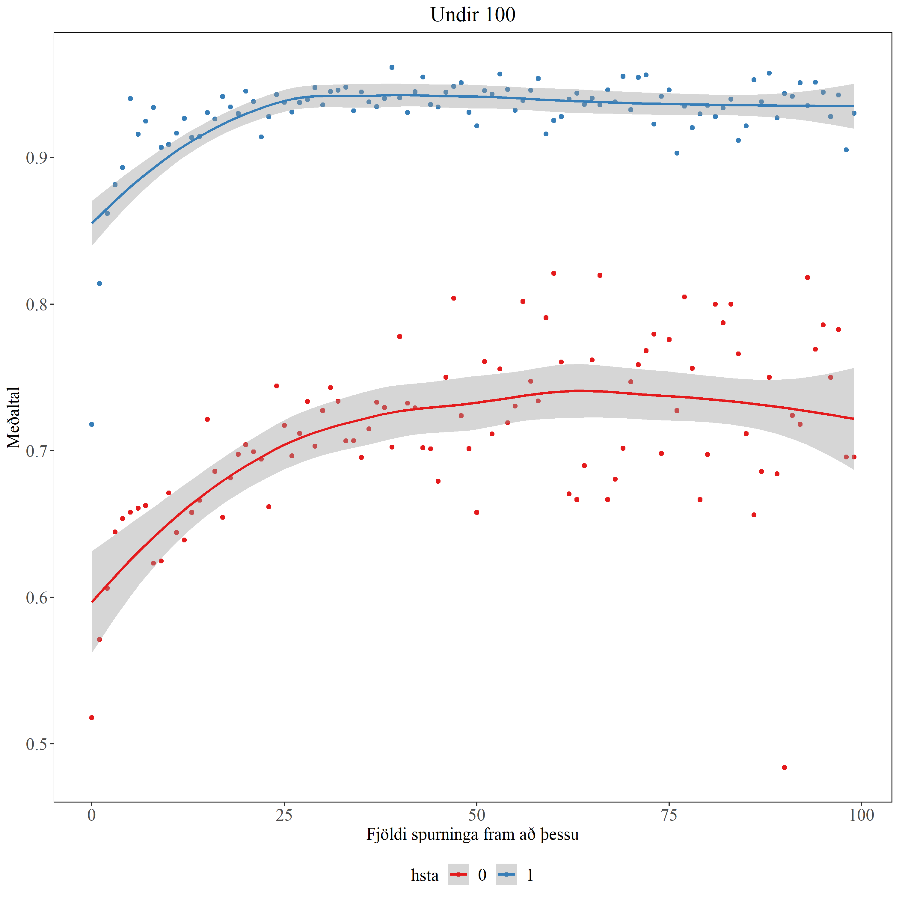
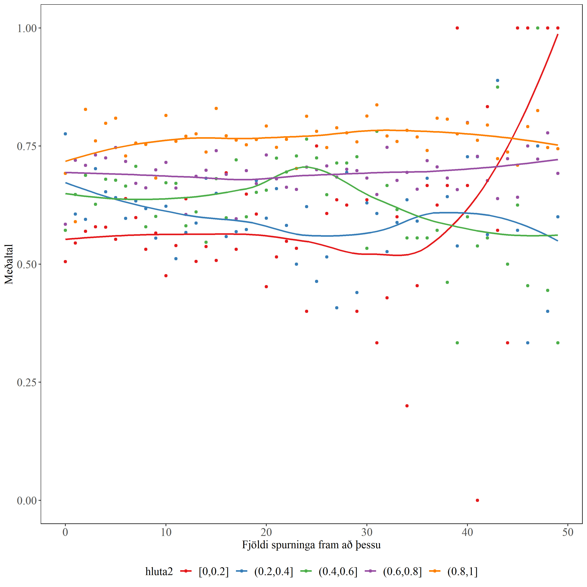

```{r setup, include=FALSE}
knitr::opts_chunk$set(echo = TRUE)
options(knitr.kable.NA = '')

source('Script/Settings.R')

hashAnswer <- read.csv('Data/hashAnswer4.csv')
hashAnswer <- hashAnswer %>% subset(select=-c(X))
hashAnswer$hsta <- hashAnswer$hsta%>%as.character()
hashAnswer$lectureId <- hashAnswer$lectureId %>% as.factor()
hashAnswer$studentId <- hashAnswer$studentId %>% as.factor()
hashAnswer$nicc <- hashAnswer$nicc %>% as.factor()
hashAnswer$hluta2 <- cut_interval(hashAnswer$hluta, n = 5)
```

# Inngangur
Tutor-web er... Gott að spyrja um góða leið til að útskýra það í byrjunn

Spurningar í tutor-web eru stundum búnar til þannig að kennari semur fyrst einn haus og svo tvo hauga af fullyrðingum, einn með réttum svörum og einn með röngum svörum. Svo eru spurningarnar búnar til með því að velja slembið rétt svar og slurk af röngum svörum (kannski með allt/ekkert ofangreint er rétt). Ef nemandi lærir ekki bara utanað, heldur er að auka skilning á verkefnið, þá ættu að sjást smátt og smátt framfarir í einkunn líka fyrir nýjar fullyrðingar. (Frá Gunnari þegar kynnt var verkefnið. Þarf að endur orða)

Þar eftir kemur hugsunin hvort hægt sé að sjá framfarir nemanda en ekki bara utanbókarlærdóm? Til að fara djúpar í það, þá er skoðað fyrst hvernig gögninn líta út og hvort það sést framfarir eftir því hve margar spurningar nemandinn hefur svarað fram að þessu með tilliti til hvort réttu svarmöguleikarnir hafi sést áður og hlutfall rangra svarmöguleika sem hafa sést áður.

VEIT EKKI HVAÐ MEIRA ÉG ÆTTI AÐ BÆTA VIÐ Á ÞESSUM PUNKTI

# Aðferð

## framkvæmd 
EKKI ALVEG VISS HVAÐ ÉG ÆTTI AÐ SETJA HÉR, HMMMMMMMMM...

## Þáttakendur
Úrtak rannsóknarinnar voru nemendur í líkindareikningur og tölfræði á vormisserinu 2020. Þar voru `r hashAnswer$studentId %>% unique() %>% length()` nemendur sem svöruðu samtals 108.017 spurningum í heild.
`r #getur verið að það eru 294 nemendur, hmmm`
## Tölfræðileg úrvinnsla

### Hugbúnaður
Öll tölfræðileg úrvinnsla, meðhöndlun gagna og líkanasmíð fór fram á forritunarmálinu `r #Textabútur sem var copy-paste aður frá hinni greininni. Laga til seinna`
R v4.0.0 í viðmótinu RStudio v1.3.959

### Gögn
Gögninn sem voru fenginn voru tekinn beint úr sql gagnagrunns eða fenginn sem .txt skrá. Frá SQL gagnagrunninum var fengið gagnasett fyrir öll svör nemanda, gagnasett fyrir allar spurningar og svo gagnasett fyrir stillingu nemenda innan við hvern fyrirlestur. Svo texta skrár með hash fyrir alla réttu svarmöguleikana og ranga svarmöguleikana. Eftir sameiningu, þá var haldið eftirfarandi breytum:

```{r table1, echo=F}

data.frame(Breyta = c("lectureId", "studentId", "questionId", "correct", "hash", "fsfat", "hsta", 
                      "hluta", "timeDif", "nicc", "gpow", "hluta2"), 
           Tegund = c("Merkibreyta", "Merkibreyta", "Merkibreyta", "Flokkabreyta", "Flokkabreyta", 
                      "Samfelld breyta", "Flokkabreyta", "Samfelld breyta", "Samfelld breyta", 
                      "Flokkabreyta", "Samfelld breyta", "Flokkabreyta"), 
           Skýring = c("Númer fyrirlesturs", "Númer nemenda", "Númer spurningar", 
                       "Hvort svarað var rétt eða rangt", "Hver svarmöguleikinn er", 
                       "Fjöldi spurninga svarað fram að þessari spurningu", 
                       "Hef séð þetta rétta svar áður", "hlutfall rangra svarmöguleika sem hafa sést áður", 
                       "Tímamunur séðan rétta svarið sást seinast", "Fjöldi vitlausa svarmöguleika", 
                       "Erfileika hraði fyrir uppkomandi spurningar", 
                       "Discretized hlutfall rangra svarmöguleika sem hafa sést áður")) %>% 
  kable(digits = 4, booktabs = T) %>% 
  kable_styling()
```


### Gagnavinnsla
Vinnslan til að fá gagnasettið yfir í það form sem var notað, gerði eftirfarandi aðgerðir.

Fyrsta skrefið var að tengja saman öll gagnasettin. Byrjandi með því að tengja svörinn og spurningarnar, svo hægt væri að tengja við réttu og röngu svörinn seinna. Eftir það var tengt við fyrirlestra stillingar nemenda til að finna *gpow* þeirra. Svo var tengt við röngu svörinn og reiknað var *hluta*, en þar var tapað u.þ.b. `r 108017-101994` línum. Svo í lokinn var tengt réttu svörinn og reiknað hvort nemandinn hafi séð svarið áður eða ekki fyrir hverja spurningu.

Ákveðið var að taka minna en allt gagnasafnið, með því að skoða ekki spurningar sem koma eftir að nemandinn hefur svarað 100 sinnum. Þetta kemur frá þeirri hugsun að eftir að hafa svarað svona margar spurningar, þá er nemandinn ekki að sjá mikið nýtt, svo ekki er hægt að sjá framfarir við sambærilegar spurningar þar.


### Breytur
Það voru nokkrar breytur sem var þurft að búa til, þær voru *fsfat*, *hsta*, *hluta* og *hluta2*. 

Fyrir fsfat, semsagt "Fjöldi spurninga fram að þessu", telur spurningarnar sem hafa verið svarað hingað til. Aðferðin til að búa til fsfat fór svona:

  1. Raða safninu eftir tíma sem spurninginn byrjaði
  2. fyrir hvern nemenda í hverjum fyrirlestri, telja upp frá 0 eftir röðinni.


Að næstu fyrir hsta, semsagt "hef séð þetta rétta svar áður". Fyrir hvern nemenda, þá var fundið fyrsta skiptið sem nemandinn sá svarið, svo var sett að ef nemandinn sá það í fyrsta skiptið, þá hafði hann ekki séð svarið áður, annars hefur nemandinn séð svarið áður. Nema í tilvikum þar sem NOTA+ spurning er að ræða, semsagt "None of the above" er rétta svarið. Þá var sett að ef hlutfall rangra svarmöguleika sem nemandinn hafi séð áður væri 100%, þá er talið að nemandinn hafi séð rétta svarið áður.

Að lokum var sett upp hluta, semsagt "hlutfall rangra svarmöguleika sem hafa sést áður". Þar var fyrst fundið fyrir hvern nemenda, hvort ranga svarið hafi sést áður og sett upp eins og hsta. Eftir það var tekið meðaltal rangra svara sem hafa sést áður til að fá hlutfallið. Sér hugsun þurfti að koma tengt spurningu með "all of the above" sem rangur möguleiki og "None of the above" sem rangur möguleiki. Fyrir fyrra tilvikið var skoðað hvort eitthvað af hinum röngu valmöguleikunum hafa sést áður, ef svo þá var hugsað eins og "all of the above" ranga svarið hafi sést áður. Fyrir "NOTA-" þá var skoðað hvort rétta svarið hafi sést áður, ef svo þá var hugsað eins og "NOTA-" svarmöguleikinn hafi sést áður.

Að lokum fyrir *hluta2* þá var skipt *hluta* upp í 5 jafn langa parta, semsagt tilvikin þegar 0%-20% af röngu svarmöguleikunum hafa sést áður, tilvikin fyrir 20%-40% og svo framvegis upp að 80%-100%.


### Aðferðarfræði við líkanasmið

Það voru gerð þrjú "mixed effect logistic regression" líkön, þar sem aðalmunur þeirra er að:

   * Fyrsta líkanið inniheldur víxláhrif milli *fsfat* og *hsta*, en inniheldur ekki *hluta2*.
   * Annað líkanið inniheldur *hluta2*, en inniheldur ekki *fsfat*.
   * Þriðja líkanið inniheldur *fsfat* og *hluta2*, en ekki víxláhrif milli *fsfat* og *hsta*.

Með þessum líkönum, væri hægt að skoða hvort það koma framfarir. Þar sem hugsuninn byggist á því að ef *fsfat* er ennþá marktækt, þá eru framfarir að sjást. Því sem fleiri spurningar eru svarað, þá eru líkurnar á að næstu spurningu er svarað rétt að hækka. Hægt er að sjá það sem framfarir. Á móti kemur áhrif utanbókarlærdóms, sem kemur frá réttu og röngu svarmöguleikunum sem hafa komið áður


# Niðurstöður

## lýsandi tölfræði

### öll gögn

Fyrir aðal flokkabreyturnar, þá er gott að geta séð hlutföll og fjölda þeirra.
```{r Table1, echo = FALSE}
createUsable <- function(df){
  t <- table(df$hsta)
  fr1 <- rbind(fjoldi = t, hlutfall = prop.table(t)) %>% t() 

  t2 <- table(df$lectureId)
  fr2 <- rbind(fjoldi = t2, hlutfall = prop.table(t2)) %>% t() 

  t3 <- table(df$correct)
  fr3 <- rbind(fjoldi = t3, hlutfall = prop.table(t3)) %>% t() 

  t4 <- table(df$hluta2)
  fr4 <- rbind(fjoldi = t4, hlutfall = prop.table(t4)) %>% t() 

  fullthing <- rbind(fr3, fr1, fr4, fr2)
  fullthing[, 2] <- paste0(round(fullthing[, 2] * 100, digits = 1), "%")

  row.names(fullthing) <- c("Rangt", "Rétt", "Sést í fyrsta skipti", "Hef séð svarið áður", 
                          "0% - 20%", "20% - 40%", "40% - 60%", "60% - 80%", "80% - 100%", 
                          3082, 3201, 3202, 3203, 3204, 3208, 3209, 3210, 3211, 3212, 3213, 3214, 3215)
  return(fullthing)
}
fullthing <- createUsable(hashAnswer)

fullthing %>% kable(longtable = T, digits = 5, booktabs = T) %>%
   kable_styling() %>%
  pack_rows("correct", 1, 2) %>%
  pack_rows("hsta", 3, 4) %>%
  pack_rows("hluta2", 5, 9) %>%
  pack_rows("lectureId", 10, 22) %>%
  column_spec(1, width = "4cm")

```

Mikið af gögnunum hér eru spurningar svarað rétt, spurningar með rétta svarmöguleika sem nemendar hafa séð áður og spurningar þar sem nemandurnir hafa séð 80%-100% af röngu svarmöguleikunum áður. Semsagt ef skoðað eru öll gögninn, þá sést að mikið af því er ekkert nýtt.

Vandinn gæti verið frá því að þegar það er búið að svara svo mörgum spurningum, þá er erfitt að sjá beinar framfarir yfir utanbókarlærdóm, þar sem flestir svarmöguleikar hafa sést áður. Skoðum aðeins hvernig hlutfall af svörunum fara yfir einhvern sérstakan punkt

```{r limit check, echo=F}
a <- hashAnswer %>% summarise("FY50" = sum(fsfat >= 50), "FY100" = sum(fsfat >= 100), 
                              "FY150" = sum(fsfat >= 150), "FY200" = sum(fsfat >= 200), 
                              "FY250" = sum(fsfat >= 250), "FY300" = sum(fsfat >= 300))
b <- hashAnswer %>% summarise("HY50" = mean(fsfat >= 50), "HY100" = mean(fsfat >= 100), 
                              "HY150" = mean(fsfat >= 150), "HY200" = mean(fsfat >= 200), 
                              "HY250" = mean(fsfat >= 250), "HY300" = mean(fsfat >= 300))
ab <- cbind(a, b)
FHbylim <- ab %>% pivot_longer(c('FY50', 'HY50', 'FY100', 'HY100', 'FY150', 'HY150', 'FY200', 'HY200', 'FY250', 'HY250', 'FY300', 'HY300'), 
                    names_to = "typewLim", values_to = "values") %>% 
  separate(typewLim, into = c("type", "limit"), sep = 2) %>% pivot_wider(names_from = type, values_from = values)

FHbylim$HY <- paste0(round(FHbylim$HY * 100, digits = 1), "%")
FHbylim %>% kable(digits = 4, booktabs = T) %>% 
  kable_styling()
```

Það sést að 29.4% af gögnunum eru svör eftir 50 spurningar svarað, en bara 9% gagnanna eftir 100 spurningum. Svo til að geta fengið betri skoðun á gögnunum, þá var ákveðið að skipta gögnunum upp í tvö gagnasöfn, í fyrri er ekki leift meiri 100 fsfat og í seinni er ekki leift meira en 50 fsfat. Þau gagnasöfn eru notuð héðan í frá.


### Stytt gögninn

```{r shorter table, echo = F}
hashLim50 <- hashAnswer %>% group_by(studentId) %>% mutate("count" = n()) %>%
  filter(count > 7 & fsfat < 50)
hashLim100 <- hashAnswer %>% group_by(studentId) %>% mutate("count" = n()) %>%
  filter(count > 7 & fsfat < 100)
```

Það getur verið sterkur áhugi að stilla upp sömu töflu aftur, nema í tilviki með bara upp að 100 spurningum svarað í einu og svo 50 spurningum svarað í einu.


```{r shorter table 100, echo=F}
fullt100 <- createUsable(hashLim100)

fullt100 %>% kable(longtable = T, digits = 5, booktabs = T) %>%
   kable_styling() %>%
  pack_rows("correct", 1, 2) %>%
  pack_rows("hsta", 3, 4) %>%
  pack_rows("hluta2", 5, 9) %>%
  pack_rows("lectureId", 10, 22) %>%
  column_spec(1, width = "4cm")
```

Héðan sést að hlutfall rangra svarmöguleika hækkar aðeins, sömuleiðis með rétt svör sem sést í fyrsta skiptið. Ef stytt er enn meira þá sést:

```{r shorter table 50,echo=F}
fullt50 <- createUsable(hashLim50)

fullt50 %>% kable(longtable = T, digits = 5, booktabs = T) %>%
   kable_styling() %>%
  pack_rows("correct", 1, 2) %>%
  pack_rows("hsta", 3, 4) %>%
  pack_rows("hluta2", 5, 9) %>%
  pack_rows("lectureId", 10, 22) %>%
  column_spec(1, width = "4cm")
```

Hér er hlutfall rangra svarmöguleika aftur aðeins stærra, svo er hvort rétta svarið hafi sést áður eða ekki er miklu nær helmingi en áður. Nemendur eru enn að sjá mikið af eindurtekningum, en það er orðið jafnara.

Til að geta séð hvernig árangur kemur með tíma, þá var skoðað meðaltal réttra svara fyrir hvert *fsfat* upp að 50 og svo upp að 100. Semsagt hvað er prósenta spurninga sem var svarað rétt hjá spurningu nr. x, þetta er svo skipt fyrir bæði réttu svör sem eru að sjást í fyrsta sinn og þau sem hafa sést áður. Skoðað fyrst fyrir fyrstu 50:


```{r pltbymean50, echo=FALSE, fig.align='center', fig.cap="Upp að 50 meðaltal", fig.pos='H', out.width='100%'}
include_graphics('Imgsimplify/plotbymean50.png')

```


Það lítur út fyrir að einhverjar framfarir gætu verið að gerast hér, þar sem nýju svörinn eru að vaxa með tíma, sem bendir sterklega til þess að það eru framfarir í gangi hjá nemendum, hvað með þegar skoðað er upp að hundrað:

```{r pltbymean100, echo=FALSE, fig.align='center', fig.cap="Upp að 100 meðaltal", fig.pos='H', out.width='100%'}

```

Það sést að þegar það er farið lengra, þá fer tilvikin þar sem rétta svarið sést í fyrsta skiptið fer að jafnast út og fer svo aðeins niður. Afhverju þetta jafnast svona út þegar lengra er farið gæti verið útaf því að dreifingin er óstöðugri þar sem lengra er farið, þar sem minni spurninga þar sem réttu svörinn hafa ekki sést áður koma upp. Annað sem gæti verið hér að baki er að það sem sást í fyrri myndinni var ekki endilega beinar framfarir, en frekar það að nemandirnir eru að setja röngu svarmöguleikana á minnið. Þá er línan í myndinni að jafnast því að nemandirnir eru ekki að sjá mikið af nýjum mögulegum röngum svarmöguleikum lengur, svo línan jafnast.

Hugmynd er að skoða líka sambærilega mynd, nema bara fyrir tilvikið þegar þetta eru ný svör og skipt upp eftir hlutfall rangra svarmöguleika sem hafa sést áður, þetta er gert til að sjá hvort innan við hvers hlutfallshóp það eru framfarir eða eru aðall framfarirnar stökkin frá einum hlutfallshópi yfir á næsta. Skoðum fyrst fyrir fyrstu 50 tilvikinn

```{r meanbyhlutfall50, echo=FALSE, fig.align='center', fig.cap="meðaltal fyrir hlutfall, upp að 50", fig.pos='H', out.width='100%'}

```

Hér sést að þegar við skoðum eftir hlutföllum rangra svara, þá eru línunar orðnar jafnari en vöxturinn sem sást fyrst, það er smá vöxtur hjá 60%-80% og 80%-100%, eitthvað fall hjá 20%-40% og 40%-60% go svo rosalegt stökk hjá 0%-20%. óstöðugleikinn gæti verið að koma frá því að það eru mjög fáar breytur fyrir aftan sumt af punktunum, til að jafna það út þá endurgerði ég myndina með þeim mun að fjarlægja punkta sem eru bara með 1 "observation" fyrir aftan það.

```{r meanbyhlutfall50Lim, echo=FALSE, fig.align='center', fig.cap="meðaltal fyrir hlutfall, upp að 50. Með minnsta kosti 2 svör á hverjum punkti", fig.pos='H', out.width='100%'}
include_graphics('Img/meanbyhlutfallLim.png')
```

Stóra stökkið hjá 0%-20% tilvikinu er aðeins stöðugra, en fyrir utan það, þá er ekki nein breyting hér.

Til að fá betri sjónarhorn á hlutföllin, þá gæti verið gott að bæta við línurnar hjá hlutföllunum við mynd X, semsagt hafa línuna fyrir tilvikið þegar nemandinn hefur ekki séð rétta svarið áður með línurnar hjá hlutfall röngu svarmöguleikana fram að þessu hliðiná. Dökkbláa línan er upprunalega línan frá mynd X, á meðan hinar línurnar eru fyrir sitthvora hlutfalls hópana.

```{r meanbyhlutfallandhsta, echo=FALSE, fig.align='center', fig.cap="meðaltal fyrir hlutfall, upp að 50. Með meðaltal hjá fyrsta skiptið séð rétta svarið", fig.pos='H', out.width='100%'}
include_graphics('Img/meabwhsbyhlutfall.png')
```

Hér sést að á meðan upprunalega línan er vaxandi, þá eru hin ekki að vaxa jafn mikið. Miklar sveiflur sjást hjá minni hlutföllunum, sem eru líklegast að koma frá því að ekki eru mikið af spurningum sem eru að koma upp með svona fáa ranga svarmöguleika. Það sést samt hjá 60%-80% að það er smá fall en svo byrja að koma framfarir í gang og hjá 80%-100% þá eru einhverjar framfarir í gangi en það jafnar sig svo aðeins út í lokinn.

Að sömu leiti getum við skoðað sömu mynd fyrir tilvikið þegar farið er upp að 100 spurningum svarað

```{r meanbyhlutfallandhsta100, echo=FALSE, fig.align='center', fig.cap="meðaltal fyrir hlutfall, upp að 100. Með meðaltal hjá fyrsta skiptið séð rétta svarið", fig.pos='H', out.width='100%'}
include_graphics('Img/meabwhsbyhlutfall100.png')
```

Það lítur út fyrir að vera einhverjar framfarir í gangi þar, hjá tilvikunum með 20%-60% þá er eitthvað að vaxa, spurning hvort þetta er að vaxa almennilega eða hvort þetta er að koma frá því tilviki að mjög fáar breytur eru að toga þeim upp. Fyrir tilvikin þegar 60%-80% af röngu svarmöguleikunum hafi sést áður

### Smá samantekt fyrir myndirnar
Þegar við skoðuðum fyrstu myndina, þá leit út fyrir að það var einhver jákvæður vöxtur voru að koma með fjölda spurninga svarað, þá kom spurningin hvort þessi vöxtur eru framfarir eða utanbókarlærdómur röngu svarana og að þar sem nemandarnir hafa séð fleiri ranga svarmöguleika því fleiri spurninga sem er svarað, þá er vöxturinn aðallega bara tengdur utanbókarlærdómi. Þar sást að línurnar voru jafnari en upprunalega línan, en með einhverjar framfarir þar ennþá, Til að sjá hvort framfarirnar eru ennþá marktækar þá eru skoðuð þrjú "logistic mixed effect" líkönn, þar sem nokkrar breytur eru alltaf til staðar hjá þeim öllum, en það er skipt upp þannig að fyrsta líkanið inniheldur fjölda spurninga svarað fram að þessu, næsta líkanið inniheldur hlutfall rangra svara fram að þessu flokkana og í lokinn er þriðja líkanið sem skoðar með bæði fjölda spurninga fram að þessu og hlutfall rangra svara fram að þessu. Hugmyndinn er að ef fjöldi spurninga fram að þessu er enn marktæk eftir að bæta við hlutfall rangra svarmöguleika, þá gæti það verið að benda til þess að hægt sé að sjá framfarir nemenda.

## líkanasmið

### breytur

Það voru gerð þrjú líkönn til að skoða, þar sem aðal munurinn er hvort notað er *fsfat*, *hluta2* eða bæði. Hér sýnir tafla X allar breyturnar sem eru í líkönunum, frá þeim sem eru í öllum líkönunum og þeim sem er skipt út á milli þeirra.

```{r table of use, echo = F, cache=TRUE}

data.frame(Breyta = c("lectureId", "hsta", "nicc", "gpow",  "studentId", "fsfat", "hluta2"),
           Tegund = c("Flokka", "Flokka", "Flokka", "Samfelld", "Flokka", "Samfelld", "Flokka"), 
           Flokkar = c("3082, 3201 - 3204, 3208 - 3215", "Sést í fyrsta skipti, Hef séð áður", 
                       "1, 2, 3, 4, 5, 6, 7", "", "VEIT EKKI HVAÐ ÉG SET HÉR", "", 
                       "[0-0.2], (0.2-0.4], (0.4-0.6], (0.6-0.8], (0.8-1]")) %>% 
  kable(longtable = T, digits = 5, booktabs = T) %>%
  kable_styling() %>%
  pack_rows("Fixed effect fyrir öll líkön", 1, 4) %>%
  pack_rows("Mixed effect fyrir öll líkön", 5, 5) %>%
  pack_rows("Fixed effect breytist eftir líkani", 6, 7) %>%
  column_spec(1, width = "5cm")

```

Þar sem aðal munur líkananna þriggja er:

  * Fyrsta: fsfat +  fsfat:hsta + ...
  * Annað: hluta2 + ...
  * Þriðja: fsfat + hluta2 + ...


### val á líkani

Líkanið var byggt ofaná líkani hans Þórarinns Jómundsson (SPURNING HVERNIG HÆGT SÉ AÐ BENDA TIL ÞESS), með bættari breytu með röngu svarmöguleikanna og tímaröðina fyrir aftan *fsfat*

\textbf{Fyrsta líkanið}: Til að byrja með var skoðað hvernig væri að bæta við *fsfat* og víxláhrif á milli *fsfat* og *hsta*. Til að sjá hvernig framfarir eru í gangi. Þar sem hugsað er að jákvæð áhrif hjá *fsfat* gæti verið séð sem framfarir nemenda. 

Vandi kom upp frá hugsuninni hvort þetta voru framfarir, eða bara utanbókarlærdómur sem var fyrir aftan *fsfat* svo því var prufað að skipta út *hluta2* og *fsfat* til að sjá hvor hefur meiri áhrif.


\textbf{Annað líkanið:} Hér var notað *hluta2* í stað *fsfat* og víxláhrif *hsta* og *fsfat*. Það var svo skoðað muninn á milli þeirra í gegnum anova til að sjá hvort væri sterkari áhrifinn, frekar hvort að framfarir sem sást í *fsfat* voru nokkuð bara áhrif *hluta2*. 

Að lokum til að skoða saman, var sameinað og sett upp líkann sem innihélt báðar breyturnar


\textbf{Þriðja líkanið:} Hér var notað *hluta2* og *fsfat* saman, til að sjá hvort enn er hægt að sjá framfarir með *fsfat* þegar *hluta2* er innifallið enn í líkaninu. 

### Matsgæði líkana
```{r model creation, echo=F, cache=TRUE}
fit1 <- glmer(correct ~ fsfat*hsta + nicc + gpow + lectureId + (1 | studentId), 
              family = binomial(link = "logit"), data = hashLim100, nAGQ = 0, control =
                glmerControl(optimizer="bobyqa", optCtrl=list(maxfun=2e5)))
fit3 <- glmer(correct ~ hluta2+hsta + nicc + gpow + lectureId + (1 | studentId), 
              family = binomial(link = "logit"), data = hashLim100, nAGQ = 0, control = 
                glmerControl(optimizer="bobyqa",optCtrl=list(maxfun=2e5)))
fit7 <- glmer(correct ~ hluta2 + fsfat + hsta + nicc + gpow + lectureId + (1 | studentId), 
              family = binomial(link = "logit"), data = hashLim100, nAGQ = 0, control = 
                glmerControl(optimizer="bobyqa",optCtrl=list(maxfun=2e5)))
```

```{r booteddata prep, echo=F}
load("Data/Bootedfit1")
load("Data/Bootedfit3")
load("Data/Bootedfit7")

optim.cal <- function(bdf) {
  # The original model on the original dataset
  B.app <- bdf[[1]]
  # The booted model on the booted dataset
  B.boot <- bdf[[2]]
  # The booted model on the original dataset
  B.or <- bdf[[3]]
  
  auc.app <- B.app$AUC
  Brier.app <- B.app$brier
  stBrier.app <- B.app$StanBrier
  
  auc.phi <- mean(B.boot$AUC - B.or$AUC)
  Brier.phi <- mean(B.boot$brier - B.or$brier)
  stBrier.phi <- mean(B.boot$StanBrier - B.or$StanBrier)
  
  optimism <- data.frame(AUC = auc.phi, brier = Brier.phi, stBrier = stBrier.phi)
  optimismcorrected <- data.frame(AUC = auc.app - auc.phi, brier = Brier.app - Brier.phi, stBrier = stBrier.app - stBrier.phi)
  
  return(list(optimism, optimismcorrected))
}

fit1.cal <- optim.cal(bootedfit1)
fit3.cal <- optim.cal(bootedfit3)
fit7.cal <- optim.cal(bootedfit7)

fit1.opt.cor <- fit1.cal[[2]]
fit1.opt.op <- fit1.cal[[1]]
fit3.opt.cor <- fit3.cal[[2]]
fit3.opt.op <- fit3.cal[[1]]
fit7.opt.cor <- fit7.cal[[2]]
fit7.opt.op <- fit7.cal[[1]]

```

Tafla X sýnir hér frammistöðu líkannana þriggja eftir AUC og standardized brier skorinu, eftir "optimism correction" eftir 2500 bootstrap ítranir. Það sést hér að munurinn á milli líkannana er ekki það mikill, þar sem stærsti munurinn er hjá fyrsta og þriðja líkaninu og það er ekki meira en `r round(fit7.opt.cor$AUC - fit1.opt.cor$AUC, digits = 4)` hjá AUC og `r round(fit7.opt.cor$stBrier - fit1.opt.cor$stBrier, digits = 4)` hjá standardized brier skorinu. Þá lítur út fyrir að það er ekki mikill munur þar með tilliti til AUC og standardized Brier. Til að bæta þá inniheldur tafla X "optimism" fyrir líkönin 3, þar sést að "optimism" er rosalega líkt hjá þeim öllum þremur. 

Á mynd X sést svo hvernig AUC og standardized brier skorið dreifðist fyrir hverja ítrun. Þar sést að hvert líkann er aðeins hærra en það fyrra og að fyrir AUC þá er dreifingin á "Train" gildunum miklu meiri en hjá "Test" gildunum, en það er svo öfugt fyrir standardized brier, því þar er dreifingin hjá "Test" meiri en hjá "Train" gildunum.

```{r optimism table 2, echo = FALSE}
rbind(fit1 = fit1.opt.cor, fit3 = fit3.opt.cor, fit7 = fit7.opt.cor) %>% dplyr::select(-c(brier)) %>% kable(digits = 4, booktabs = T) %>%
  kable_styling()
```

```{r optimism table, echo = FALSE}
rbind(fit1 = fit1.opt.op, fit3 = fit3.opt.op, fit7 = fit7.opt.op) %>% dplyr::select(-c(brier)) %>% kable(digits = 4, booktabs = T) %>%
  kable_styling()
```


```{r optimismpicture, echo=FALSE, fig.align='center', fig.cap="Dreifing AUC og Standardized brier fyrir hvert líkann, hjá ``Train`` og ``Test`` bootstrap gildunum", fig.pos='H', out.width='100%'}
include_graphics('Img/optimism.png')
```


### Mat stika lokalíkana

```{r fit1 table, echo = F}
fit1.coef <- summary(fit1)$coefficients %>% as.data.frame() %>% 
  add_column(odds = exp(summary(fit1)$coefficients[,1]), .after = 0)
colnames(fit1.coef) <- c("Gagnalíkindahlutfall", "Hallastuðull", "SE", "z-próf", "p")

fit1.coef <- fit1.coef %>% add_row(.after = 2) %>% add_row(.after = 4) %>% add_row(.after = 12)
row.names(fit1.coef) <- c("Skurðpunktur", "fjöldi spurninga fram að þessu", 
                          "hef ekki séð rétta svarmöguleikann áður (Viðmið)",
                          "Hef séð rétta svarimöguleikann áður", "1 rangur svarmöguleiki (Viðmið)", 
                          "2 rangir svarmöguleikar", "3 rangir svarmöguleikar", "4 rangir svarmöguleikar", 
                          "5 rangir svarmöguleikar", "6 rangir svarmöguleikar", "7 rangir svarmöguleikar",
                          "gpow","Fyrirlestur a (Viðmið)", "Fyrirlestur b", "Fyrirlestur c",
                          "Fyrirlestur d", "Fyrirlestur e", "Fyrirlestur f", "Fyrirlestur g", 
                          "Fyrirlestur h", "Fyrirlestur i", "Fyrirlestur j", "Fyrirlestur k", 
                          "Fyrirlestur l", "Fyrirlestur m", "víxláhrif fjöldi spurninga og hafa séð rétta svarmöguleikann")
fit1.coef %>% kable(digits = 4, booktabs = T) %>% kable_styling(full_width = T, font = 7) %>% 
  pack_rows("Hef séð rétta svarmöguleikann áður", 3, 4, hline_after = T) %>%
  pack_rows("Fjöldi rangra svarmöguleika", 5, 11, hline_after = T) %>%
  pack_rows("", 12, 12, hline_after = T) %>%
  pack_rows("hvaða fyrirlestur", 13, 25, hline_after = T) %>%
  pack_rows("", 26, 26, hline_after = T)
```

```{r fit3 table, echo = F}
fit3.coef <- summary(fit3)$coefficients %>% as.data.frame() %>% 
  add_column(odds = exp(summary(fit3)$coefficients[,1]), .after = 0)
colnames(fit3.coef) <- c("Gagnalíkindahlutfall", "Hallastuðull", "SE", "z-próf", "p")

fit3.coef <- fit3.coef %>% add_row(.after = 1) %>% add_row(.after = 6) %>% add_row(.after = 8) %>% 
  add_row(.after = 16)
row.names(fit3.coef) <- c("Skurðpunktur", "0%-20% (viðmið)", "20%-40%", "40%-60%", 
                          "60%-80%", "80%-100%", "hef ekki séð rétta svarmöguleikann áður (Viðmið)",
                          "Hef séð rétta svarimöguleikann áður", "1 rangur svarmöguleikar (Viðmið)", 
                          "2 rangir svarmöguleikar", "3 rangir svarmöguleikar", "4 rangir svarmöguleikar", 
                          "5 rangir svarmöguleikar", "6 rangir svarmöguleikar", "7 rangur svarmöguleikar",
                          "gpow","Fyrirlestur a (Viðmið)", "Fyrirlestur b", "Fyrirlestur c",
                          "Fyrirlestur d", "Fyrirlestur e", "Fyrirlestur f", "Fyrirlestur g", 
                          "Fyrirlestur h", "Fyrirlestur i", "Fyrirlestur j", "Fyrirlestur k", 
                          "Fyrirlestur l", "Fyrirlestur m")
fit3.coef %>% kable(digits = 4, booktabs = T) %>% kable_styling(full_width = T, font = 7) %>%
  pack_rows("Hlutfall rangra svarmöguleika sem hafa sést áður", 2, 6, hline_after = T) %>%
  pack_rows("Hef séð rétta svarmöguleikann áður", 7, 8, hline_after = T) %>%
  pack_rows("Fjöldi rangra svarmöguleika", 9, 15, hline_after = T) %>%
  pack_rows("", 16, 16, hline_after = T) %>%
  pack_rows("hvaða fyrirlestur", 17, 29, hline_after = T)
```
```{r fit7 table, echo = F}
fit7.coef <- summary(fit7)$coefficients %>% as.data.frame() %>% 
  add_column(odds = exp(summary(fit7)$coefficients[,1]), .after = 0)
colnames(fit7.coef) <- c("Gagnalíkindahlutfall", "Hallastuðull", "SE", "z-próf", "p")

fit7.coef <- fit7.coef %>% add_row(.after = 1) %>% add_row(.after = 7) %>% add_row(.after = 9) %>%
  add_row(.after = 17)
row.names(fit7.coef) <- c("Skurðpunktur", "0%-20% (viðmið)", "20%-40%", "40%-60%", 
                          "60%-80%", "80%-100%", "fjöldi spurninga fram að þessu", 
                          "hef ekki séð rétta svarmöguleikann áður (Viðmið)",
                          "Hef séð rétta svarimöguleikann áður", "1 rangur svarmöguleikar (Viðmið)", 
                          "2 rangir svarmöguleikar", "3 rangir svarmöguleikar", "4 rangir svarmöguleikar", 
                          "5 rangir svarmöguleikar", "6 rangir svarmöguleikar", "7 rangur svarmöguleikar",
                          "gpow","Fyrirlestur a (Viðmið)", "Fyrirlestur b", "Fyrirlestur c",
                          "Fyrirlestur d", "Fyrirlestur e", "Fyrirlestur f", "Fyrirlestur g", 
                          "Fyrirlestur h", "Fyrirlestur i", "Fyrirlestur j", "Fyrirlestur k", 
                          "Fyrirlestur l", "Fyrirlestur m")
fit7.coef %>% kable(digits = 4, booktabs = T) %>% kable_styling(full_width = T, font = 7) %>%
  pack_rows("Hlutfall rangra svarmöguleika sem hafa sést áður", 2, 6, hline_after = T) %>%
  pack_rows("", 7, 7, hline_after = T) %>%
  pack_rows("Hef séð rétta svarmöguleikann áður", 8, 9, hline_after = T) %>%
  pack_rows("Fjöldi rangra svarmöguleika", 10, 16, hline_after = T) %>%
  pack_rows("", 17, 17, hline_after = T) %>%
  pack_rows("hvaða fyrirlestur", 18, 30, hline_after = T)
```


# Umræða
Markmið verkefnisins er að sjá hvort hægt sé að mæla framfarir, en ekki bara utanbókarlærdóm. Til að gera það var byrjað að sjá hvort hægt væri að finna jákvæðar breytingar þegar svarað eru fleiri og fleiri spurningar með því að skoða myndir með meðaltali spurninga sem var svarað rétt eftir því hve margar spurningar nemandinn hafði svarað hingað til og skipt upp eftir því hvort nemandinn hafði séð rétta svarmöguleikann áður eða ekki. Þar sást einhverjar framfarir í gangi, en óvissa var hvort þetta voru beinar framfarir eða utanbókarlærdómur á röngu svarmöguleikunum. Þá var skoðað líka mynd með tilliti til hlutfall rangra svarmöguleika sem hafa sést áður. Þar leit úr fyrir að vera eitthverja framfarir, sumar jákvæðar og sumar neikvæðar. En annars miklu beinari línur en fyrri. Til að gá hvort þetta eru framfarir í gangi þar, þá voru skoðuð nokkur líkunn, með þá hugmynd að baki að ef fjöldi spurninga fram að þessu er enn marktæk með öllum utanbókarlærdómi með í líkaninu, þá gæti það verið að benda til þess að hægt er að mæla framfarir nemendans. Þessi þrjú líkönn voru lík að mörgu leiti nema það var smá breyting milli tveggja breyta. Fyrsta líkanið innhélt fjöldi spurninga fram að þessu, til að sjá framfarir nemenda, annað líkanið innihélt hlutfall rangra svarmöguleika sem hafa sést áður og að lokum þriðja líkanið sem innihélt bæði fjölda spurninga fram að þessu og hlutfall rangra svarmöguleika sem hafa sést áður. 


## fyrsta líkanið
Til að byrja með, þá var gert fyrsta líkanið til að sjá hvort það var hægt að sjá framfarir eftir því hve margar spurningar nemandinn hafði svarað hingað til innan í fyrirlestrinum. Þar var breyta yfir því hvort rétta svarið hafi sést áður og víxláhrif á milli þess og fjölda spurninga svarað. Þar sást að fjöldi spurninga svarað var marktæk og framfarir sást þar. 

Vandi kemur upp að þegar svarað hefur mikið, þá er stærri og stærri hlutfall af röngu svörunum sem hafa sést áður, því getur vel verið að framfarirnar sem eru að sjást hér, eru í raun bara utanbókarlærdómur rangra svara sem er að toga líkur á að svara rétt upp. Því var skoðað hlutfall rangra svarmöguleika án fjölda spurninga fram að þessu.

## Annað líkanið
Þegar skoðað var annað líkanið, þá var séð að hluta2 er marktæk breyta miðað við Anova III. Til að sjá muninn milli fyrra líkansins og þessara þá var gert anova á milli þeim til að sjá hvort af líkönunum voru marktækari, skv. anova þá er annað líkanið sterkara en fyrra líkanið. Svo var skoðað aðeins standardized brier score og AUC þeirra tveggja, þar leit út fyrir að annað líkanið er aðeins sterkara en það fyrra, með muninn milli þeirra sem `r round(fit3.opt.cor$AUC - fit1.opt.cor$AUC, digits = 4)` hjá AUC og `r round(fit3.opt.cor$stBrier - fit1.opt.cor$stBrier, digits = 4)` hjá standardized brier skorinu. Svo á meðan annað líkara er sterkara miðað við anova, þá er munurinn ekki endilega það mikill. (ÓVISS UM EFTIRFARANDI:) Þetta bendir til þess að fjöldi spurninga svarað fram að þessu er jafn sterkt og að skoða hlutföllin þeirra, eru þá framfarirnar sem sáust áður bara útaf hlutfall röngru svara, eða voru framfarir þar?

Til að skoða það, þá er skoðað þriðja líkanið, þá er innihaldið bæði fjöldi spurninga fram að þessu og hlutfall rangra svarmöguleika fram að þessu, en víxláhrifin á milli fjölda spurninga fram að þessu og hvort rétta svarið hafi sést áður er horfið.

## Þriðja líkanið
Að lokum var sett saman þriðja líkanið, í líkaninu er bæði fjöldi spurninga fram að þessu og hlutfall rangra svarmöguleika sem hafa sést áður. Þar var bæði fjöldi spurninga og hlutfall rangra svarmöguleika bæði marktækt, svo var þriðja líkanið sterkara en annað og fyrsta líkönin, ef skoðað er til "optimism correct" standardized brier og AUC þá lítur út fyrir að munurinn milli þriðja og annars er líka mjög lítill, þar sem munurinn milli þriðja og Annars líkansins er `r round(fit7.opt.cor$AUC - fit3.opt.cor$AUC, digits = 4)` hjá AUC og `r round(fit7.opt.cor$stBrier - fit3.opt.cor$stBrier, digits = 4)` hjá standardized brier skorinu. Þetta bendir til að öll þrjú líköninn eru lík í styrkleika miðað við standardized brier og AUC á meðan þriðja líkanið er sterkast af þeim miðað við anova.

Hvað þýðir þetta? Frá þessu sjáum við að fjöldi spurninga fram að þessu er ennþá marktækt, þótt það sé bætt við utanbókaráhrifum hjá því hvort rétti svarmöguleikinn hafi sést áður og hlutfall rangra svarmöguleika sem hafa sést áður, þar bendir til þess að hægt sé að mæla áhrif nemenda. Þar sem stikinn fyrir fsfat er séð sem framfarir. 

## Smá loka niðurstöður 
Svo frá líkönunum er hægt að finna rök fyrir bæði að nógu sterkt er að skoða bara hlutfall rangra svarmöguleika sem hafa sést áður og að skoða fjölda spurninga svarað miðað við að AUC og standardized brier skorið er mjög líkt milli líkannana þriggja, þetta gæti verið að benda til rosalegu sterku áhrif utanbókarlærdóms til að sjá hvernig svarað er næst. 

Á sömu mótum þá er fyrsta og þriðja líkönin líka í sama styrkleika miðað við AUC og standardized brier skorið, semsagt hægt er að fá stika fyrir fjölda spurninga fram að þessu. Sem leyfir því að mæla framfarir nemenda frá spurningu til spurninga, að sjá hverjar framfarirnar eru þegar nemandinn byrjaði til þann punkts þar sem nemandinn kláraði.

## Smá upphát hugsanir um hugmyndir til að skoða í framtíðinni
Spurning kemur samt að því hvernig hægt væri að skoða framfarir hvers nemenda fyrir sig, hugmynd að því væri að bæta við fjöldi spurninga fram að þessu í mixed effect í líkaninu, semsagt hafa (1 + fsfat | studentId) í líkaninu í staðinn fyrir (1 | studentId). Þá myndi fást framfarir hvers nemanda, ef þetta er rétt hugsun. Vandinn við svona líkann er að það tekur miklu lengur að keyra miðað við upprunalega líkanið.

Annað væri að skoða meiri sambærilegar spurningar, með því að hafa fjölda spurninga fram að þessu vera telja eftir spurningahaus, frekar enn að skoða innan við fyrirlesturs.