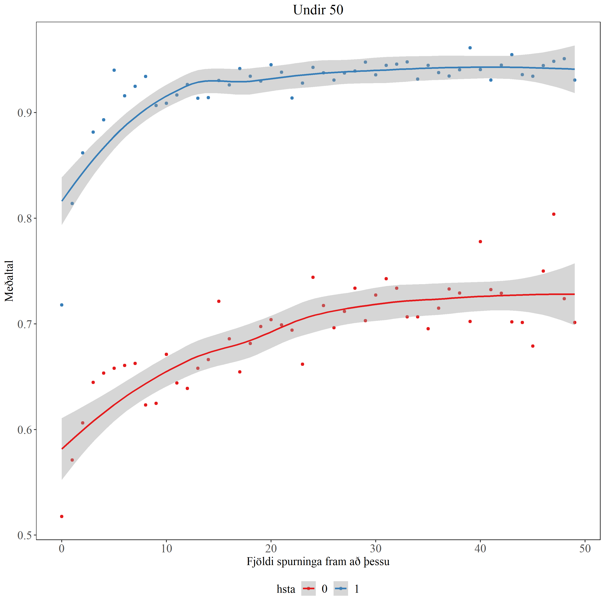

```{r setup, include=FALSE}
knitr::opts_chunk$set(echo = TRUE)

source('Script/Settings.R')

hashAnswer <- read.csv('Data/hashAnswer4.csv')
hashAnswer <- hashAnswer %>% subset(select=-c(X))
hashAnswer$hsta <- hashAnswer$hsta%>%as.character()
hashAnswer$lectureId <- hashAnswer$lectureId %>% as.factor()
hashAnswer$studentId <- hashAnswer$studentId %>% as.factor()
hashAnswer$nicc <- hashAnswer$nicc %>% as.factor()
hashAnswer$hluta2 <- cut_interval(hashAnswer$hluta, n = 5)
```

# Inngangur
Tutor-web er... Gott að spyrja um góða leið til að útskýra það í byrjunn

Spurningar í tutor-web eru stundum búnar til þannig að kennari semur fyrst einn haus og svo tvo hauga af fullyrðingum, einn með réttum svörum og einn með röngum svörum. Svo eru spurningarnar búnar til með því að velja slembið rétt svar og slurk af röngum svörum (kannski með allt/ekkert ofangreint er rétt). Ef nemandi lærir ekki bara utanað, heldur er að auka skilning á verkefnið, þá ættu að sjást smátt og smátt framfarir í einkunn líka fyrir nýjar fullyrðingar. `r #Frá Gunnari þegar kynnt var verkefnið. Þarf að endur orða`

Svo spurning kemur um að hvort það sé hægt að mæla framfarir, en ekki bara utanaðbókarlærdóm. `r #NEED TO GET THIS PROBERLY WORDED LATER`

SKOÐA HVAÐ HÆGT SÉ AÐ BÆTA ÞEGAR SEINNA KEMUR.

# Aðferð

## framkvæmd 


## Þáttakendur
Úrtak rannsóknarinnar voru nemendur í líkindareikningur og tölfræði á vormisserinu 2020. Þar voru 294 nemendur sem svöruðu samtals 108.017 spurningum í heild.

# Tölfræðileg úrvinnsla

## Hugbúnaður
Öll tölfræðileg úrvinnsla, meðhöndlun gagna og líkanasmíð fór fram á forritunarmálinu `r #Textabútur sem var copy-paste aður frá hinni greininni. Laga til seinna`
R v4.0.0 í viðmótinu RStudio v1.3.959

## Gögn
Gögninn sem voru fenginn voru tekinn beint úr sql gagnagrunns eða fenginn sem .txt skrá. Þar var fengið gagnasett fyrir öll svör nemanda, gagnasett fyrir allar spurningar og svo gagnasett fyrir stillingu nemenda innan við hvers fyrirlesturs. Svo texta skrár með hash fyrir alla réttu svara og rangra svara innan við vormisserinu 2020. Af þeim breytum var svo ákveðið að halda í gagnasafninu eftirfarandi breytur:

| Breyta     | Tegund          | Skýring                                              |
|------------|-----------------|------------------------------------------------------|
| lectureId  | Merkibreyta     | Númer fyrirlesturs                                   |
| studentId  | Merkibreyta     | Númer nemenda                                        |
| questionId | Merkibreyta     | Númer spurningar                                     |
| correct    | Flokkabreyta    | Hvort svarað var rétt eða rangt                      |
| hash       | Flokkabreyta    | Hver svarmöguleikinn er                              |
| fsfat      | Samfelld breyta | Fjöldi spurninga svarað fram að þessari spurningu    |
| hsta       | Flokkabreyta    | Hef séð þetta rétta svar áður                        |
| hluta      | Samfelld breyta | Hlutfall rangra svara sem hafa sést áður             |
| timeDif    | Samfelld breyta | Tímamunur séðan rétta svarið sást seinast            |
| nicc       | Flokkabreyta    | Fjöldi vitlausa svarmöguleika                        |
| gpow       | Samfelld breyta | Erfileika hraði fyrir uppkomandi spurningar          |
| hluta2     | Flokkabreyta    | Discretized hlutfall rangra svara sem hafa sést áður |


## Gagnavinnsla
Til að geta fengið gögninn sem eru hér að ofan. Þá þurfti að gera einhverjar vinnslur til að fá þær.

Til að hægt væri að setja öll gögninn saman, þá þurfti að tengja saman öll gagnasettin. Fyrst svörinn og spurningarnar, til að geta tengt við réttu svörinn. Eftir það var tengt við sillingu nemenda til að finna gpow hvers nemenda. Svo far tengt röngu svörinn og reiknað var hluta. Mínus þaðan er að þar var tapað u.þ.b. `r 108017-101994` línum. Svo í lokinn var tengt réttu svörinn og reiknað hvort nemandinn hafi séð svarið áður eða ekki fyrir hverja spurningu.

Ákveðið var að taka minna en allt gagnasafnið, með því að skoða ekki spurningar sem koma eftir að nemandinn hefur svarað 100 sinnum. Þetta kemur frá þeirri hugsun að bara smár hluti af gögnunum eru þau seinu gildin sem eru að fara yfir 100 spurningum svarað.

SÉ SEINNA HVAÐ GÆTI VERIÐ GOTT AÐ BÆTA VIÐ HÉRNA, ER EKKI ENN VISS


## Breytur
Það voru nokkrar breytur sem var þurft að búa til, þeir voru fsfat, hsta og hluta. 

Fyrir fsfat, semsagt "Fjöldi spurninga fram að þessu", telur spurningarnar sem hafa verið svarað hingað til. Aðferðin til að búa til fsfat fór svona:
  1. Raða safninu eftir tíma sem spurninginn byrjaði
  2. fyrir hvern nemenda í hverjum fyrirlestri, telja upp frá 0 eftir röðinni.
Þegar það var keyrt, þá var komið fsfat.

Að næstu fyrir hsta, semsagt "hef séð þetta rétta svar áður". Fyrir hvern nemenda, þá var fundið fyrsta skiptið sem nemandinn sá svarið, svo var sett að ef nemandinn sá það í fyrsta skiptið, þá hafði hann ekki séð svarið áður, annars hefur nemandinn séð svarið áður. Nema í tilvikum þar sem NOTA+ spurning er að ræða, semsagt "None of the above" er rétta svarið. Þá var sett að ef hlutfall rangra svara sem nemandinn hafi séð áður væri 100%, þá er talið að nemandinn hafi séð rétta svarið áður.

Að lokum var sett upp hluta, semsagt "hlutfall rangra svara sem hafa sést áður". Þar var fyrst fundið fyrir hvern nemenda, hvort ranga svarið hafi sést áður og sett upp eins og hsta. Eftir það var tekið meðaltal rangra svara sem hafa sést áður. Frá því kom hlutfallið. Sér hugsun þurfti að koma tengt spurningu með "all of the above" sem rangur möguleiki og "None of the above" sem rangur möguleiki. Fyrir fyrra tilvikið var skoðað hvort eitthvað af hinum röngu valmöguleikunum hafa sést áður, ef svo þá var hugsað eins og "all of the above" ranga svarið hafi sést áður. Fyrir "NOTA-" þá var skoðað hvort rétta svarið hafi sést áður, ef svo þá var hugsað eins og "NOTA-" svarmöguleikinn hafi sést áður.

Fyrir hluta2, þá var "discretizised" hluta í 5 jafn langa parta

NÚ, ÉG VEIT EKKI HVORT ÞAÐ ER MEIRA TIL AÐ SEGJA HÉR, EN GEYMUM ÞETTA Í BILI
NÉ HVORT ÞETTA ÆTTI AÐ VERA Í GREININNI TIL AÐ BYRJA MEÐ, GETUR VEL VERIÐ AÐ ÞETTA ER ALVEG ÓNOTANLEGT

## Aðferðarfræði við líkanasmið

Það voru gerðar þrjú "mixed effect logistic regression" líkön, þar sem aðalmunur þeirra er að:

   * Fyrsta líkanið inniheldur víxláhrif milli fsfat og hsta, en inniheldur ekki hluta2.
   * Annað líkanið inniheldur hluta2, en inniheldur ekki fsfat.
   * Þriðja líkanið inniheldur fsfat og hluta2, en ekki víxláhrif milli fsfat og hsta.

Með þessum líkönum, væri hægt að skoða hvort það koma framfarir. Þar sem hugsuninn byggist á því að ef fsfat er ennþá sterkt, þá eru framfarir að sjást. Því sem fleiri spurningar eru svarað, þá eru líkurnar á að næstu spurningu er svarað rétt að hækka. Hægt er að sjá það sem framfarir. Á móti kemur áhrif utanbókarlærdóms, sem kemur frá réttu og röngu svarmöguleikunum sem koma aftur.

KANNSKI HÆGT AÐ NEFNA MEIRA HÉR, EN VEIT EKKI. FINNST ÞETTA VERA MIKIÐ SVONA SKRÝTIÐ. ORÐA ÞETTA LÍKA AÐEINS ÖÐRUVÍSI, SÉ TIL SEINNA


# Niðurstöður

## lýsandi tölfræði

### öll gögn

Góð byrjun er að skoða fyrst hlutföll gagnanna allra. Fyrir Aðal flokkabreyturnar, þá gæti verið gott að fylgjast með hlutfall gagnanna undir hverjum flokki
```{r Table1, echo = FALSE}
createUsable <- function(df){
  t <- table(df$hsta)
  fr1 <- rbind(fjoldi = t, hlutfall = prop.table(t)) %>% t() 

  t2 <- table(df$lectureId)
  fr2 <- rbind(fjoldi = t2, hlutfall = prop.table(t2)) %>% t() 

  t3 <- table(df$correct)
  fr3 <- rbind(fjoldi = t3, hlutfall = prop.table(t3)) %>% t() 

  t4 <- table(df$hluta2)
  fr4 <- rbind(fjoldi = t4, hlutfall = prop.table(t4)) %>% t() 

  fullthing <- rbind(fr3, fr1, fr4, fr2)
  fullthing[, 2] <- paste0(round(fullthing[, 2] * 100, digits = 1), "%")

  row.names(fullthing) <- c("Rangt", "Rétt", "Sést í fyrsta skipti", "Hef séð svarið áður", 
                          "0% - 20%", "20% - 40%", "40% - 60%", "60% - 80%", "80% - 100%", 
                          3082, 3201, 3202, 3203, 3204, 3208, 3209, 3210, 3211, 3212, 3213, 3214, 3215)
  return(fullthing)
}
fullthing <- createUsable(hashAnswer)

fullthing %>% kable(longtable = T, digits = 5, booktabs = T) %>%
   kable_styling() %>%
  pack_rows("correct", 1, 2) %>%
  pack_rows("hsta", 3, 4) %>%
  pack_rows("hluta2", 5, 9) %>%
  pack_rows("lectureId", 10, 22) %>%
  column_spec(1, width = "4cm")

```

Mikið af gögnunum hér eru rétt svo, svör sem nemendur hafa séð áður og spurningar þar sem nemandinn hefur séð 80%-100% af röngu svarmöguleikunum áður. Svo mikið af gögnunum eru ekkert nýtt.

Vandinn gæti verið frá því að einhverjir nemendur eru að svara miklu fleiri spurningum en aðrir. Skoðum aðeins hvernig hlutfall af svörunum fara yfir einhvern sérstakan punkt

```{r limit check, echo=F}
a <- hashAnswer %>% summarise("FY50" = sum(fsfat >= 50), "FY100" = sum(fsfat >= 100), 
                              "FY150" = sum(fsfat >= 150), "FY200" = sum(fsfat >= 200), 
                              "FY250" = sum(fsfat >= 250), "FY300" = sum(fsfat >= 300))
b <- hashAnswer %>% summarise("HY50" = mean(fsfat >= 50), "HY100" = mean(fsfat >= 100), 
                              "HY150" = mean(fsfat >= 150), "HY200" = mean(fsfat >= 200), 
                              "HY250" = mean(fsfat >= 250), "HY300" = mean(fsfat >= 300))
ab <- cbind(a, b)
FHbylim <- ab %>% pivot_longer(c('FY50', 'HY50', 'FY100', 'HY100', 'FY150', 'HY150', 'FY200', 'HY200', 'FY250', 'HY250', 'FY300', 'HY300'), 
                    names_to = "typewLim", values_to = "values") %>% 
  separate(typewLim, into = c("type", "limit"), sep = 2) %>% pivot_wider(names_from = type, values_from = values)

FHbylim$HY <- paste0(round(FHbylim$HY * 100, digits = 1), "%")
FHbylim %>% kable(digits = 4, booktabs = T) %>% 
  kable_styling()
```

Það sést að 29.4% af gögnunum eru svör eftir 50 spurningar svarað, en bara 9% gagnanna eftir 100 spurningum. Svo til að geta fengið betri skoðun á gögnunum, þá var ákveðið að skipta gögnunum upp í tvö gagnasöfn, í fyrri er ekki leift meiri 100 fsfat og í seinni er ekki leift meira en 50 fsfat. Það gagnasafn er notað héðan í frá.


### Stytt gögninn

```{r shorter table, echo = F}
hashLim50 <- hashAnswer %>% group_by(studentId) %>% mutate("count" = n()) %>%
  filter(count > 7 & fsfat < 50)
hashLim100 <- hashAnswer %>% group_by(studentId) %>% mutate("count" = n()) %>%
  filter(count > 7 & fsfat < 100)
```

Það getur verið sterkur áhugi að teikna sömu töflu aftur, nema í tilviki með bara upp að 100 spurningum svarað í einu og svo 50 spurningum svarað í einu.


```{r shorter table 100, echo=F}
fullt100 <- createUsable(hashLim100)

fullt100 %>% kable(longtable = T, digits = 5, booktabs = T) %>%
   kable_styling() %>%
  pack_rows("correct", 1, 2) %>%
  pack_rows("hsta", 3, 4) %>%
  pack_rows("hluta2", 5, 9) %>%
  pack_rows("lectureId", 10, 22) %>%
  column_spec(1, width = "4cm")
```
Það sést að rangt hlutfallið hækkar aðeins, sama með sést í fyrsa skiptið. Hvað með næstu töflu
```{r shorter table 50,echo=F}
fullt50 <- createUsable(hashLim50)

fullt50 %>% kable(longtable = T, digits = 5, booktabs = T) %>%
   kable_styling() %>%
  pack_rows("correct", 1, 2) %>%
  pack_rows("hsta", 3, 4) %>%
  pack_rows("hluta2", 5, 9) %>%
  pack_rows("lectureId", 10, 22) %>%
  column_spec(1, width = "4cm")
```
Hérna er Rangt hlutfallið aftur aðeins stærra og hsta hlutfallið orðið miklu nær helmingi. Nemendur eru enn að sjá mikið af eindurtekningum, en það er orðið jafnara.

Til að geta séð hvernig árangur kemur með tíma, þá var skoðað meðaltal fyrir hvert fsfat upp að 50 og svo upp að 100. Semsagt hvað er meðaltal réttra svara hjá spurningu nr. x, þetta er svo skipt fyrir bæði réttu svör sem eru að sjást í fyrsta sinn og þau sem hafa sést áður. Skoðað fyrst fyrir fyrstu 50:


```{r pltbymean50, echo=FALSE, fig.align='center', fig.cap="Upp að 50 meðaltal", fig.pos='H', out.width='100%'}


```


Það lítur út fyrir að einhverjar framfarir gætu verið að gerast hér, þar sem nýju svörinn eru að vaxa með tíma, hvað með þegar skoðað er upp að hundrað:

```{r pltbymean100, echo=FALSE, fig.align='center', fig.cap="Upp að 100 meðaltal", fig.pos='H', out.width='100%'}
include_graphics('Imgsimplify/plotbymean100.png')
```

Það sést að þegar það er farið lengra, þá fer að sjá þetta í fyrsta skiptið að beinast út og fer svo aðeins niður. Hugmynd að hver vandinn er, það gæti verið að nemendur eru farinn að setja á minnið röngu svarmöguleikana, svo það eru minni svarmöguleikar sem nemandinn er að sjá.

Hugmynd er að skoða líka meðaltals mynd, nema bara fyrir tilvik þegar þetta eru ný svör og skipt upp eftir hlutfall rangra svara sem hafa sést áður. Skoðum fyrst fyrir fyrstu 50 tilvikinn

```{r meanbyhlutfall50, echo=FALSE, fig.align='center', fig.cap="meðaltal fyrir hlutfall, upp að 50", fig.pos='H', out.width='100%'}
include_graphics('Img/meanbyhlutfall.png')
```

Línurnar eru miklu beinari hér, það er samt mikið stökk hjá endanum, svo hugmynd er að taka út punktana þar sem það eru ekki fleiri en 1 að svara það, þá fæst

```{r meanbyhlutfall50Lim, echo=FALSE, fig.align='center', fig.cap="meðaltal fyrir hlutfall, upp að 50. Með minnsta kosti 2 svör á hverjum punkti", fig.pos='H', out.width='100%'}
include_graphics('Img/meanbyhlutfallLim.png')
```

Þá er það aðeins jafnara komið.

Til að geta skoðað svo aðeins áhrifinn hlið við hlið hjá Þá er hægt að setja línurnar fyrir hlutföllin ofaná línuna sem kemur þegar skoðað er allt saman, eins og var í Mynd x.

```{r meanbyhlutfallandhsta, echo=FALSE, fig.align='center', fig.cap="meðaltal fyrir hlutfall, upp að 50. Með meðaltal hjá fyrsta skiptið séð rétta svarið", fig.pos='H', out.width='100%'}
include_graphics('Img/meabwhsbyhlutfall.png')
```

Hér sést að á meðan upprunalega línan er vaxandi, þá er hin öll miklu flatari. Sum eru að sveiflast mikið, en hugsa er að það gerist að mestu útaf þörf fyrir fleiri breytur á þeim punktum.

Að sömu leiti getum við skoðað sömu mynd fyrir tilvikið þegar farið er upp að 100 spurningum svarað

```{r meanbyhlutfallandhsta100, echo=FALSE, fig.align='center', fig.cap="meðaltal fyrir hlutfall, upp að 100. Með meðaltal hjá fyrsta skiptið séð rétta svarið", fig.pos='H', out.width='100%'}
include_graphics('Img/meabwhsbyhlutfall100.png')
```

Það lítur út fyrir að vera einhverjar framfarir í gangi þar, hjá tilvikunum með 20%-60% þá er eitthvað að vaxa, spurning hvort þetta er að vaxa almennilega eða hvort þetta er að koma frá því tilviki að mjög fáar breytur eru að toga þeim upp.
Sama með fallið hjá 60%-80%.

Það sést að það eru einhverjar hækkun á fjölda réttra svara, en það er stór spurning hvort þetta eru framfarir eða bara að koma frá því að nemendur eru að setja hinar upplýsingar á minið. Skoðað er líkönn til að fá betri skilning hér.

## líkanasmið

### breytur

### val á líkani

### Matsgæði líkana

### Mat stika lokalíkana