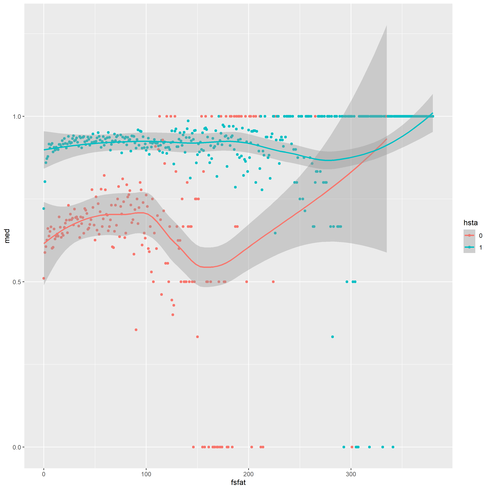
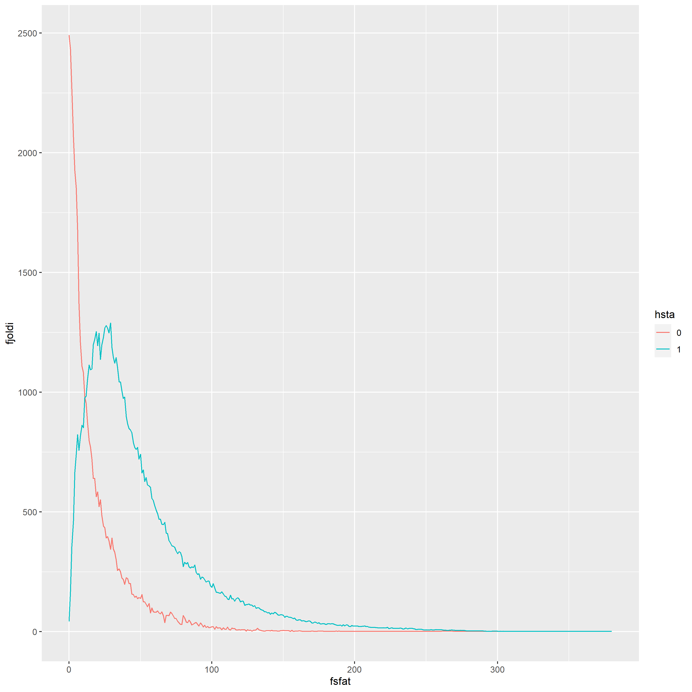

```{r setup, include=FALSE}
#knitr::opts_chunk$set(echo = TRUE)

source('Script/Settings.R')
```

# Inngangur
Aðeins til að byrja, þetta er tilraun hjá mér í að ná að orða hluti aðeins betur og koma gögnunum fram á skiljanlegan hátt. Það vantar líklega enn aðeins upp á það. En það er markmið skýrslunar hér.

Nú, rannsóknarspurninginn sem verið er að vinna með hér er:

Er hægt að mæla framfarir en ekki bara utanaðbókarlærdóm? Bera saman fyrstu svarmöguleika og þá sem hafa komið áður.


# Gögninn

Til að byrja með, er gott að skoða gögninn. Ég hef fjarlægt sumar breytur, þar sem þær voru ruglingslegar og óþarfi.
```{r datashow}
hashAnswer <- read.csv('Data/hashAnswer4.csv') %>% subset(select = -c(timeStart, fsvfat, fsvfatu, X))
hashAnswer$hsta <- hashAnswer$hsta%>%as.character()
hashAnswer$lectureId <- hashAnswer$lectureId %>% as.factor()
hashAnswer$studentId <- hashAnswer$studentId %>% as.factor()
hashAnswer$nicc <- hashAnswer$nicc %>% as.factor()
hashAnswer %>% glimpse()
```
Gagnasettið, eins og það er núna hefur 10 breytur. Breyturnar eru:

  * lectureId: Þetta er Id breyta fyrir hvaða fyrirlestur við erum í.
  
  * studentId: Þetta er Id breyta fyrir hvaða nemenda við erum með.
  
  * questionId: Þetta er Id breyta fyrir hvaða spurningu við erum með.
  
  * correct: Þetta er binary breyta sem segir til hvort það var svarað rétt eða rangt.
  
  * hash: Þetta er hash breyta sem segir til hvaða rétta svar við erum með hérna
  
  * fsfat: "fjöldi spurninga fram að þessu" þetta segir til um hve margar spurningar nemandinn hefur svarað hingað til, innan við þennan fyrirlestur. Talning byrjar á 0.
  
  * hsta: "hef séð þetta áður" er breyta sem segir til um hvort að nemandinn hefur séð rétta svarið áður eða ekki
  
  * timeDif: Þetta er breyta sem segir okkur hve langt það var séðan nemandinn sá þetta svar áður.
  
  * nicc: þetta er "number of incorrect choices", líke þekkt sem NumQ. Segir til hve margir rangir svarmöguleikar það eru.
  
  * gpow: gpow er breyta sem er sett á nemenda þegar hann byrjar á fyrirlestrinum sem segir til hve hratt hann fær erfiðari spurningar.

# Teikningar og töflur

Fyrsta sem er gott að gera, er að skoða aðeins gögninn sjálf.

## skoðað fyrir öll gögninn
Byrjum aðeins á því að skoða hve mikið af gögnunum eru nemendur að sjá nýtt svar á móti gömlu svari.

```{r}
ggplot(hashAnswer, aes(x = hsta)) +
  geom_bar()
```

Það lítur út fyrir að vera mikið meira af gögnunum sem eru svör sem hafa sést áður á móti nýjum svörum.
Þar sem u.þ.b. 2/3 af gögnunum eru spurningar með rétt svör sem hafa sést áður á meðan 1/3 af gögnunum eru spurningar með rétt svör sem eru að sjást í fyrsta sinn.

Nú markmiðið er að geta skoðað framfarir nemenda, ekki bara utanaðbókarlærdóm, svo það væri gott að setja upp graf sem inniheldur meðaltal réttra svara fyrir hvert fsfa og skipt eftir hsta. Semsagt meðaltal réttra svara hjá þeim sem hafa séð x margar spurningar hingað til, bæði fyrir þann fjölda sem hefur séð rétta svarið áður og þau sem hafa það ekki.



Það er nú smá erfitt að lesa þessa mynd, það lítur út fyrir að vera smá vaxi hjá þeim sem eru að sjá þetta í fyrsta skiptið, svo fellur það niður og aftur upp. Svo er dreifnin að vaxa því lengra sem er farið. Skoðum aðeins stærð gagnanna fyrir hvern punkt til að sjá hvað er að gerast



Hérna kemur skýringinn, það lítur út fyrir að vera stórt fall af gögnum sem eru að sjá svar í fyrsta sinn því lengra sem er farið, og líka hjá þeim sem hafa séð svarið áður. Þetta er líklega útaf því að hver nemandi fer mismunandi langt og sumir nemendur geta verið að fara lengur en hinir. Skoðum aðeins hlutföll gagnanna til að skoða þetta betur. 

```{r table by limit}
a <- hashAnswer %>% summarise("FY50" = sum(fsfat >= 50), "FY100" = sum(fsfat >= 100), 
                              "FY150" = sum(fsfat >= 150), "FY200" = sum(fsfat >= 200), 
                              "FY250" = sum(fsfat >= 250), "FY300" = sum(fsfat >= 300))
b <- hashAnswer %>% summarise("HY50" = mean(fsfat >= 50), "HY100" = mean(fsfat >= 100), 
                              "HY150" = mean(fsfat >= 150), "HY200" = mean(fsfat >= 200), 
                              "HY250" = mean(fsfat >= 250), "HY300" = mean(fsfat >= 300))
ab <- cbind(a, b)
FHbylim <- ab %>% pivot_longer(c('FY50', 'HY50', 'FY100', 'HY100', 'FY150', 'HY150', 'FY200', 'HY200', 'FY250', 'HY250', 'FY300', 'HY300'), 
                    names_to = "typewLim", values_to = "values") %>% 
  separate(typewLim, into = c("type", "limit"), sep = 2) %>% pivot_wider(names_from = type, values_from = values)


FHbylim %>% kable(digits = 4)
```

Lítur út fyrir að um 27.75% gagnanna eru af spurningum sem fara yfir 50 fsfat og bara u.þ.b. 8.29% gagnanna sem fara yfir 100. Hugmynd er þá að skera af gögninn miðað við 50 fsfat eða 100 fsfat. Skoðum þá aðeins hlutfall hsta og meðtalals grafið að ofan miðað við það.

## Skoðað eftir limit

Fyrst er að setja upp gögninn. Að auki fjarlægji ég nemendur sem svöruðu ekki fleiri en 7 spurningum samtals
```{r}
hashLim50 <- hashAnswer %>% group_by(studentId) %>% mutate("count" = n()) %>%
  filter(count > 7 & fsfat < 50)
hashLim100 <- hashAnswer %>% group_by(studentId) %>% mutate("count" = n()) %>%
  filter(count > 7 & fsfat < 100)
```

Skoðum hlutfallið aftur hjá hsta.

```{r}
ggplot(hashLim50, aes(x = hsta)) +
  geom_bar() + 
  ggtitle("undir 50")
ggplot(hashLim100, aes(x = hsta)) +
  geom_bar() + 
  ggtitle("undir 100")
```

Það sést að ef við tökum bara undir 50, þá er hsta orðið miklu nær og þegar við erum með undir 100, þá erum við kominn nálægt ójöfnunni eins og áðan. 

Gott að skoða meðaltals myndina aftur, eftir að skera eftir limit.


Nú sést aðeins betur hvað er að gerast, í fyrri sjáum við að það lítur út fyrir að vera árangur og framfarir. Þar sem báðar línunar eru að vaxa þegar fleiri spurninga hefur verið svarað. En það sést á seinni myndini að það fer að jafna sig eftir það og framfarir hætta. Svo er það eitthvað smá fall hjá nýjum svörum.

## umræður
Þá kemur spurninginn hvort þetta er nokkuð framfarir eða utanaðbókarlærdómur, í fyrri þá lítur út fyrir að líkurnar vaxa. En það virðist svo jafna sig eftir það.

   1. Ein hugmynd um hvað er að gerast þar er að þetta er ekki framfarir sem er að vaxa, heldur er það utanaðbókarlærdómur á röngu svarmöguleikunum, Það gæti verið aðal áhrifinn þar. Hugmynd til að skoða það betur væri kannski að skoða eins mynd, nema filterað bara fyrir spurningarnar sem hafa rétt svör sem eru að sjást í fyrsta skiptið og gert flokka fyrir hlutfall rangra svara sem hafa sést áður. Þá mun koma ein lína fyrir hvert hlutfall, ef það er allt beinar láréttar línur, þá gæti það bent til að verið sé að ræða utanaðbókarlærdómur sem aðal áhrifin.
   2. Önnur hugmynd er að ef við gætum skipt nemendum upp í flokka, sem nemendur sem setja allt á minnið og nemendur sem eru að læra og fá framfarir. Svo er spurning hvort framfarirnar sjást betur þa.
   3. Loka hugmynd er að í staðinn fyrir að skoða fsfat eftir fyrirlestri, að skoða það kannski frekar eftir spurningahaus, þá gæti sést betur áhrif á sambærilegum spurningum eftir því hve margar tilraunir nemandinn hefur fengið á spurninguna sjálfa.


# Modelgerð

Hér er smá grunnur af því sem ég er kominn með fyrir modelgerðina. 

Ég byrjaði að skoða einföld glm, en þar sem það er verið að ræða um mixed effect model, þá hef ég fært yfir í glmer í staðinn. Ég ákvað að keyra allt miðað við 100 limitinn, ég hef ekki neina sterka ástæðu enn, þar sem ég veit ekki um leið til að sýna hvort einn gagnasett er betri en hitt, svo mér fannst 100 vera nægilega gott í bili.

## gagnavinnsla
Fyrsta sem þarf að gera, er smá gagnavinnsla. Glmer tekur ekki vel við háu tölunum í fsfat, svo ég deili með 10 til að fá glmer til að keyra almennilega

```{r shortening fsfat}
hashLim100$fsfat <- hashLim100$fsfat/10
```

## modelin sjálf

Modelinn sem ég er að vinna með á þessum tímapunkti er

   * glmer(correct ~ fsfat\*hsta + nicc + gpow + lectureId + (1 | studentId), family = binomial(link = "logit"), ...)
   
   * glmer(correct ~ fsfat\*hsta + nicc + gpow + lectureId + (1 + fsfat \* hsta | studentId), family = binomial(link = "logit"), ...)

Stóri munurinn milli þeirra er að ég hef meira í mixed effect modelinu seinna en í því fyrra

Ég keyri módelinn ekki hér, því þau eru of löng, en hef save-að þau til seinni notkunar, svo hægt sé að load-a þeim upp
```{r loadmodel}
#Þetta er fyrri modelið
load("Data/ans22")
#Þetta er seinna modelið
load("Data/ans42")
```


## smá model Analysis

Summaríið þeirra er svo
```{r}
summary(ans22)
summary(ans42)
```
Sést að það er einhver munur hér á milli við styrkleika breytanna. Sem passar frá muninum þeirra.

Ef við skoðum aðeins Anova hjá þeim báðum

```{r anova1}
Anova(ans22, type = 3)
Anova(ans42, type = 3)
```

Þá lítur út fyrir að allar breyturnar eru marktækar hjá þeim.

## Model comparison

Hvor er svo sterkari? Skoðum aðeins anova milli þeirra

```{r anovacompare}
anova(ans22, ans42)
```
Lítur út fyrir að ans42 er betra, það getur passað þar sem það er meira leift. En vandinn er að seinni modelið tekur u.þ.b. tvöfalt lengri tíma að keyra í hvert sinn, svo þá kemur spurninginn "hve mikið betri er seinni miðað við fyrri?"

Setjum upp fall fyrir BrierScore og reiknum svo það fyrir þau bæði

```{r}
BrierScore <- function(modl, df ) {
  predicted <- predict(modl, type = "response")
  truth <- df$correct
  return(mean((predicted-truth)^2))
}

br22 <- BrierScore(ans22, hashLim100)
br42 <- BrierScore(ans42, hashLim100)

br22
br42

br22-br42
```
Nú er brierScore-ið hjá seinna minna, en bara um u.þ.b. `r round(br22-br42, digits = 6)`. Ég játa að ég veit ekki alveg enn hvað það þýðir milli styrkleikjanna þeirra, hvort það sé rosalega mikill munur eða bara smár munur.

Næst er að reikna AUC þeirra.

```{r}
Auc22 <- AUC(predict(ans22, type = "response"), hashLim100$correct)
Auc42 <- AUC(predict(ans42, type = "response"), hashLim100$correct)

Auc22
Auc42
Auc42 - Auc22
```

Hér sést að AUC er stærra hjá seinna modelinu en fyrra, um `r round(Auc42-Auc22, digits = 6)`. Ef ég skil Auc rétt, þá er seinni modelið með betra AUC.

En er þetta betra Brier og betra AUC nokkuð nógu mikið betra til að leifa tvöfalt lengri keyrslutíma fyrir eitthvað sem tekur svona langan tíma? Er ekki ennþá viss.

