```{r setup, include=FALSE}
knitr::opts_chunk$set(echo = TRUE)
source('Script/Settings.R')
```

## Gagna Innlestur
Lesið er inn gögninn
```{r Gagnalestur, warning=FALSE}
hashAnswer <- read.csv('Data/hashAnswer4.csv')
hashAnswer <- hashAnswer %>% subset(select=-c(X))
hashAnswer$hsta <- hashAnswer$hsta%>%as.character()
hashAnswer$lectureId <- hashAnswer$lectureId %>% as.factor()
hashAnswer$studentId <- hashAnswer$studentId %>% as.factor()
```
Þetta eru tutor-web gögn fyrir lík og töl í vormisseri 2020. \\
```{r data example}
glimpse(hashAnswer)
```
Gögninn innihalda factor breyturnar lectureId, studentId og questionId. Sem eru einkenningar fyrirlesturinns, nemendans og spurningarnar. Næst inniheldur það correct sem er binary breyta fyrir því hvort fengið var rétt eða rangt svar. Hash er einkvæm tenging fyrir hvert svar. fsfat er "Fjöldi spurninga fram að þessu" sem telur upp hve margar spurningar nemandinn hefur svarað hingað til í þessum fyrirlestri. fsvfat er "Fjöldi svara fram að þessu" sem telur upp hve ný svör nemandinn hefur séð að þessum punkti. fsvfatu "Fjöldi svara fram að þessu uppfært" þetta er temporary nafn sem kemur fyrir fsvfat nema þegar AOTA+ spurning kemur þá heldur það sama fsvfat fyrir þá spurningu, telst samt venjulega annars. hsta "hef séð þetta áður" þetta er 0 eða 1 sem segir til hvort nemandinn hefur séð svarið áður eða ekki. Að lokum er timeDif sem segir til hve margar sekúndur hafa varið séðan þetta svar kom seinast. \\
\\
Fyrsta sem ég gerði var að skoða aðeins einföld logistic regression föll, skipt upp eftir því hve margar spurningar, semsagt fsfat ég leifi að svara. Þá fyrir fsfat og fyrir fsvfat, byrjandi með því að skoða fsfat
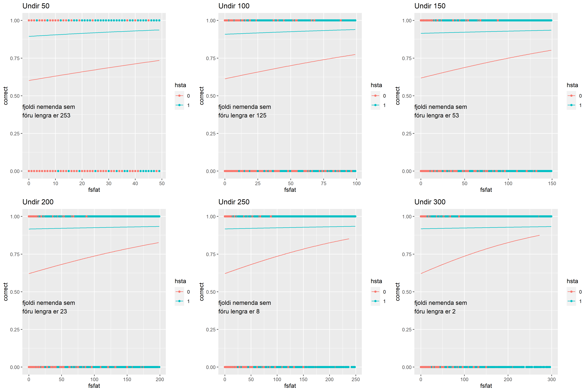

Svo fyrir fsvfat
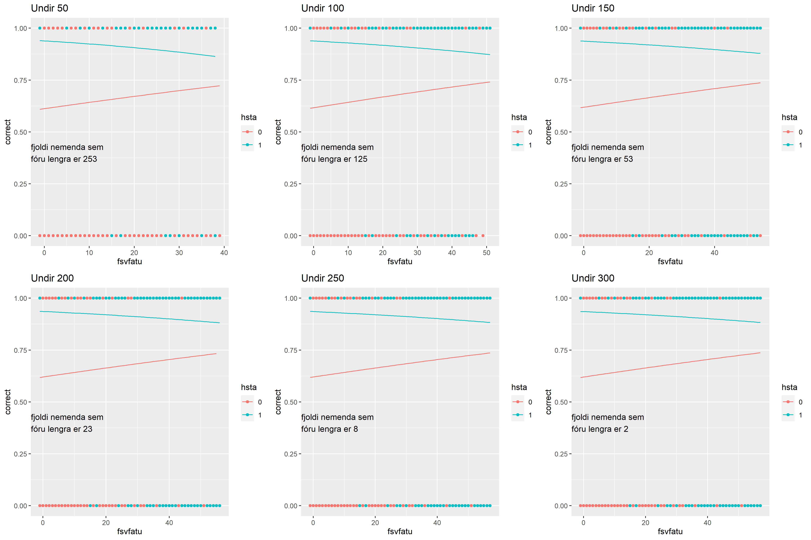
Nú líkanið sem er notað hér er einfalt glm(correct ~ fsfat\*hsta) og glm(correct ~ fsvfat\*hsta). Semsagt $p_i = H(\beta_0 + fsfat\beta_1+fsfat*hsta*\beta_2+hsta\beta_3)$ og $p_i = H(\beta_0 + fsvfat\beta_1+fsvfat*hsta*\beta_2+hsta\beta_3)$, þar sem $H$ er logistic link fallið. (Vantar enn upplýsingar sem ég mun skrifa meira um þegar þörf er, t.d. það að við erum með $p_i$ en ég merki ekki $fsfat$ með $fsfat_i$) \\

Þegar skoðað er yfir myndirnar, fyrst fyrir fsfat. Þá ef nemandinn hefur ekki séð spurningunna áður, þá lítur út fyrir að vera að vaxa líkurnar á að nemandinn fær svarið rétt, en það lítur út fyrir að því fleiri svör við skoðum, því hægari línunar vaxa, sést við þegar við skoðum hvar línan er við 50 í hvert skipti, það minnkar og minnkar. þegar nemandinn hefur séð svarið áður, þá hefur vaxinn minni og minni vaxa líka, og verður eins og bein lína að seinast grafinu. Gæti verið góð hugmynd að skoða graf þar sem tekið eru allar línu og sett á sama grafið. Prufa það seinna. \\
Nú, ef horft er á allar línurnar í einu þegar spurningin er ný þá fæst
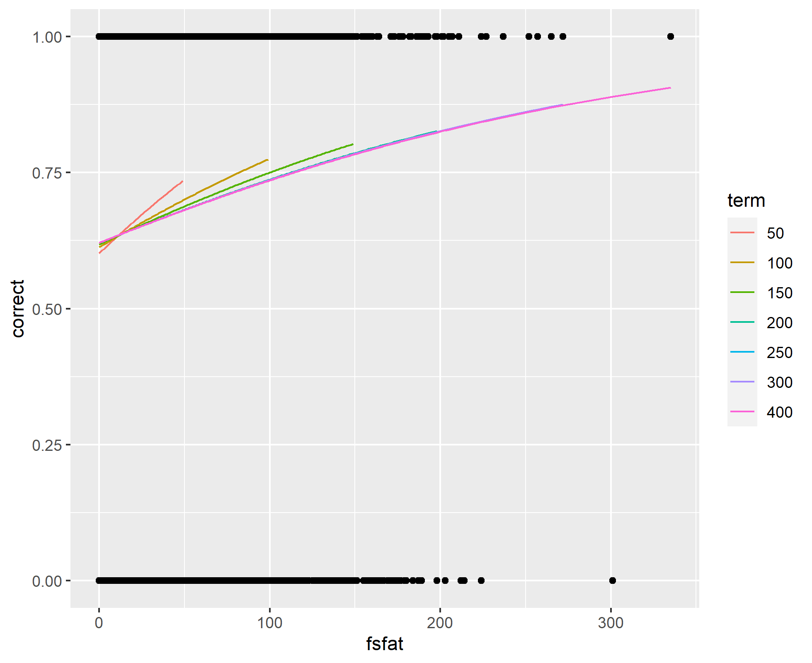
Hér sést að hallin minnkar því fleiri spurnigar eru spyrðar, hmmmm. \\

Næst Þegar það er skoðað með tilliti til fsvfat, fyrsta sem maður tekur eftir, er að líkurnar að fá rétt svar, eftir því hve mikið af svörum hefur sést hingað til er að minnka miðað við þetta líkann, svo nemandinn verður aðeins verra af með spurningum í því tilviki. Á meðan fyrir þær spurningar sem eru að sjást í fyrsta skiptið er að vaxa eins og var verið að búast við. Lítur út fyrir að þegar fleiri spurningar eru leifðar að svara, þá vex slope-ið hjá svörunum sem hafa sést áður aðeins upp, á meðan fyrir þær sem eru að koma í fyrsta sinn er ekki of mikil breyting á milli. \\
Afhverju er svona minni breyting hjá fsvfat miðað við fsfat? Þetta hefur líklega að gera við það að þeir sem eru að svara rosalega mikið eru ekki að toga línuna of mikið með hugsa ég. \\
\\

Nú þetta sýnir aðallega smá meiri vaxta, en fyrir spurningunna "Er hægt að mæla framfarir en ekki bara utanaðbókarlærdóm? Bera saman fyrstu svarmöguleika og þá sem hafa komið áður" þá er sést að það eru framfarir þegar svarið kemur fyrst eftir því lengra sem er komið, en að mínu mati er ekki komið með það hvort þetta eru framfarir eða utanbókarlærdómur, þar sem ekki er innifalið röngu svörinn ennþá, því ekki er vitað hvort nemandinn er að ná beinum framförum í nýju spurningunum, eða hvort þetta er það að nemandinn er að setja á minnið röngu svörinn og þá er vöxturinn utanaðbókarlærdómur. hmmmmmm


Eftir þessar teikningar skoðaði ég aðeins meðaltölinn fyrir hvert fsfat og fsvfat og plottaði þau. Hlið er svo fjöldi nemenda sem eru ennþá að gera dæminn
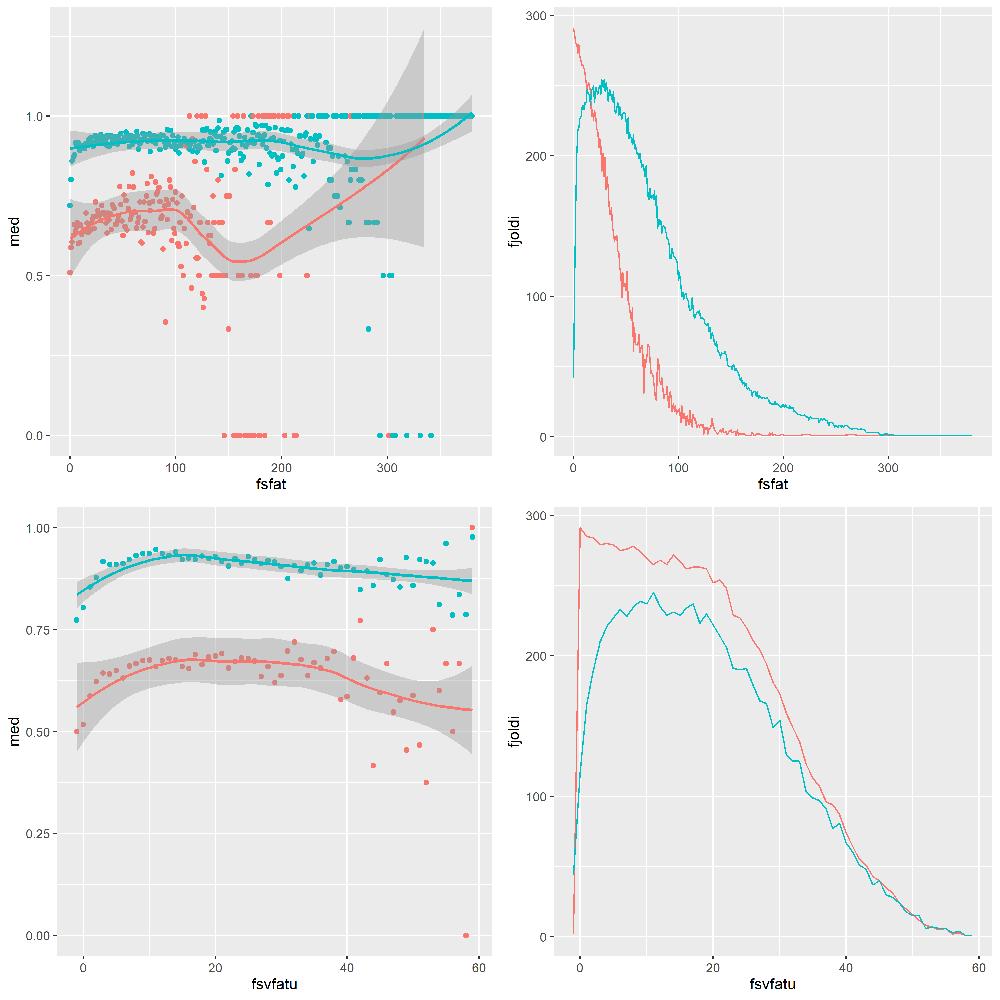
Nú, það sést að í báðum tilvikum, þá gerist tvennt hjá svörunum sem er að komast í fyrsta sinn, fyrst er að dreifinginn lítur út fyrir að stækka með tímanum, næst er að það er eitthvað fall sem kemur hjá þeim. Ég er með hugmynd um ástæðurnar, en ekkert fast. Fyrir fyrsta þá er dreifingin að stækka líklegast því að það eru minni gögn til að vinna með því lengra sem er farið, svo dreifingin stækkar því að þakka. Næst er að þegar nemendur hafa verið að svara svona mörgum spurningu, t.d. 100+, þá eru þau líklega byrjuð að flýta sér og því ekki eitt nógum tíma í hvert. Getum skoðað sömu myndir fyrir minni hópa og séð hvort það hefur áhrif
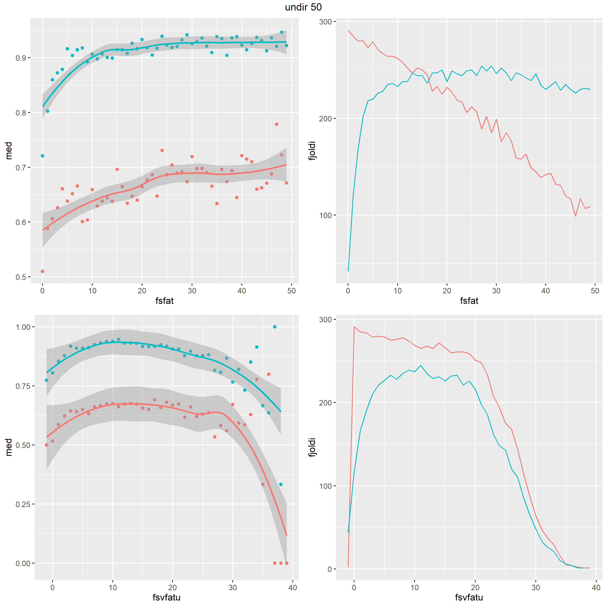
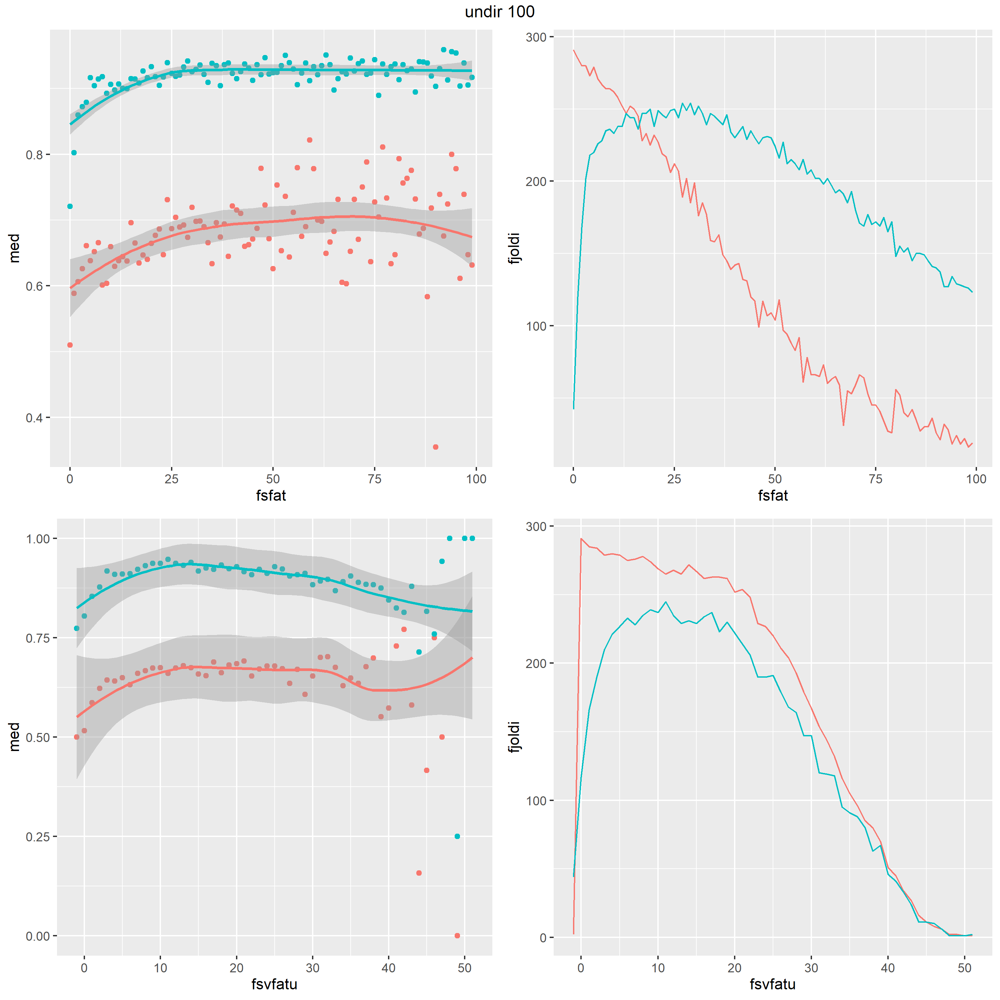
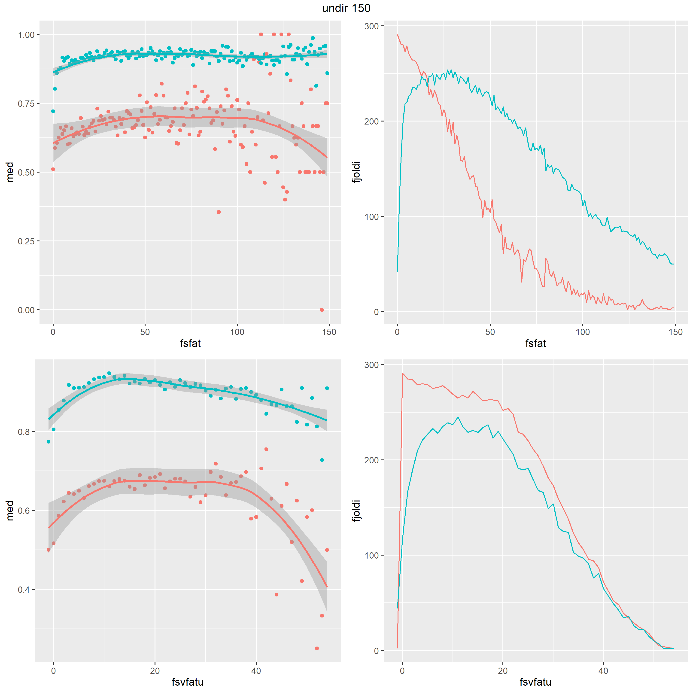
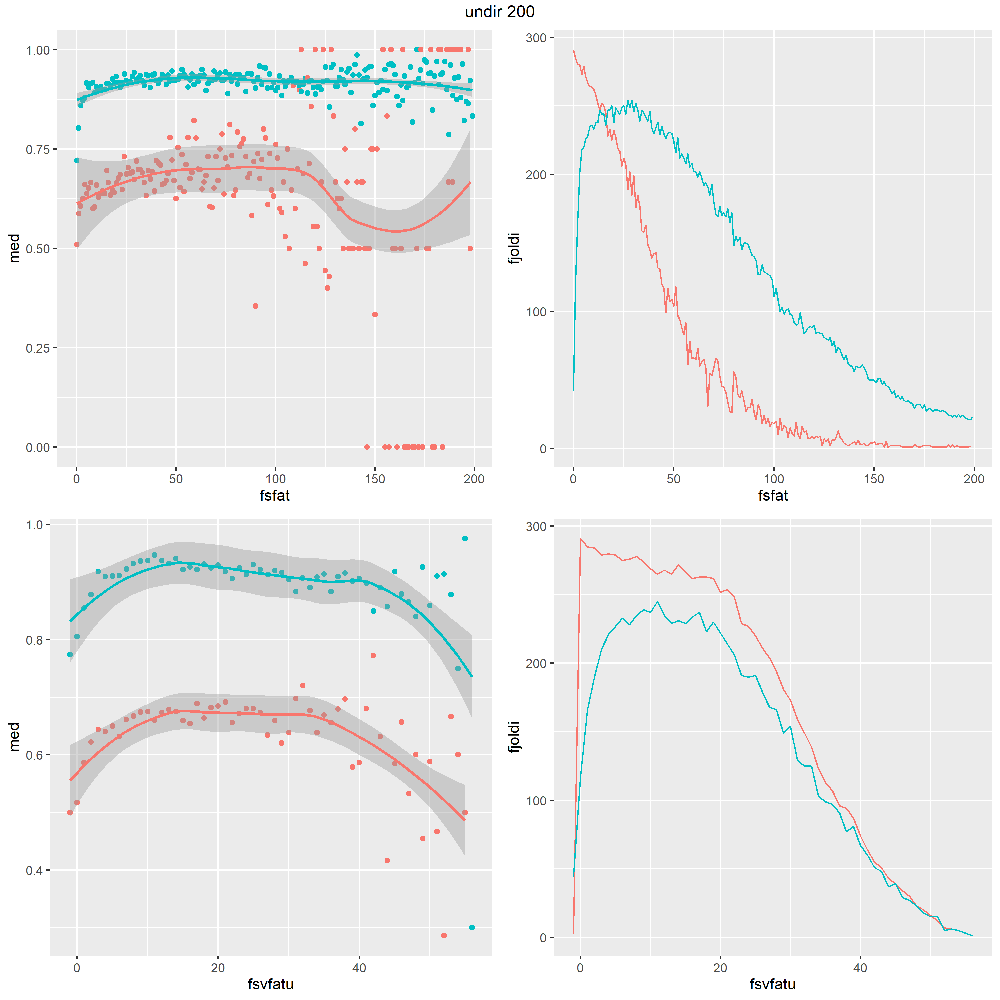
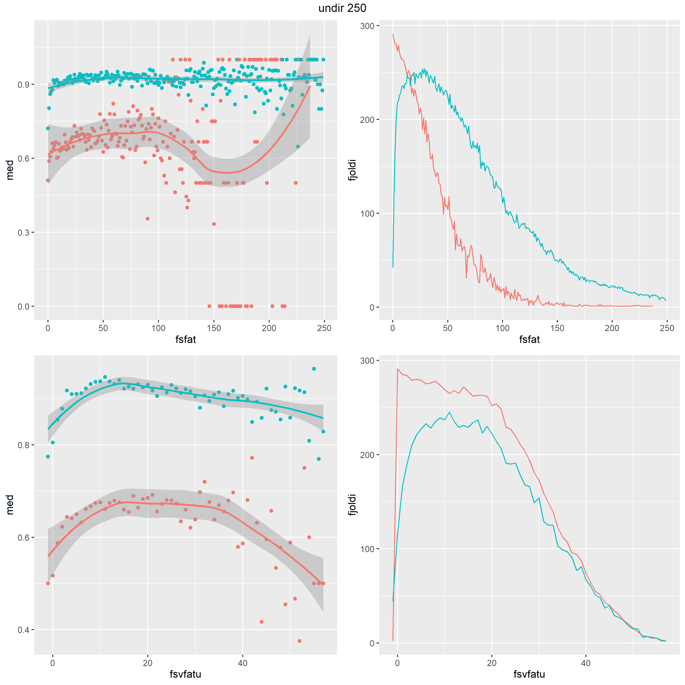
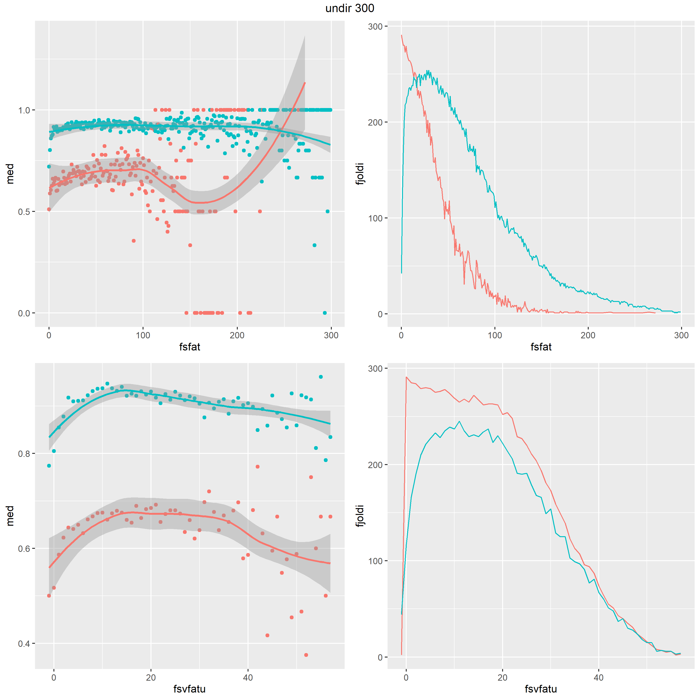
Svo að lokum skoðaði ég aðeins logistic regression föllin aftur, en skipt upp eftir lectureId og studentId
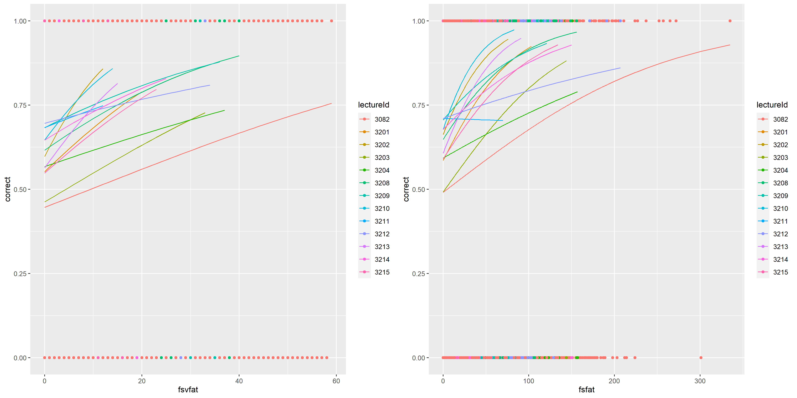
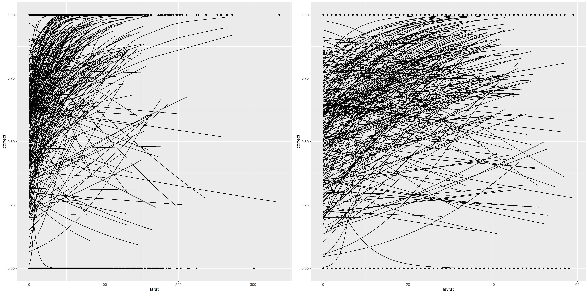


